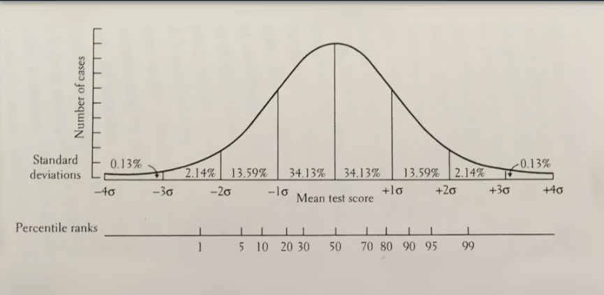

# Mindware-Critical-Thinking-for-the-Information-Age

### 常识：

- 常量
- 变量

### 第一课：统计

- [正态分布  ](https://zh.wikipedia.org/wiki/%E6%AD%A3%E6%80%81%E5%88%86%E5%B8%83) 单变量

	- 
	- **68-95-99.7法则** 经验法则

- [相关性](https://zh.wikipedia.org/wiki/%E7%9B%B8%E5%85%B3)  双变量

	- 0.5 存在相关性 ，0.8以上相关性非常强

		| 判断                 | 相关性  | 结论                             |
		| -------------------- | ------- | -------------------------------- |
		| 不同题目对智商的判断 | 0.9     | 正规的智商题目测一遍就够了       |
		| 不同行为对性格的判断 | 0.7     | 行为对性格的判断还是相对比较可靠 |
		| 不同智商对成就的判断 | 0.4-0.5 | 成就，成绩，收入与智商有一定相关 |

	- 可靠性定义

		- 特定变量在不同场合给出相同的值

	- 有效性定义

		- 特定变量在通用场合应该达到的程度 

	- 可靠性和有效性的关系

		- 没有可靠性，就没有有效性
		- 可靠性对于有效性影响很小

- [正态分布和大数定律的实验](https://www.coursera.org/learn/mindware/supplement/nWut2/interactive-activity)

## 第二课：大数定律

- 一次实验结果可能不太符合大数定律
- 多次实验结果可能也不太符合大数定律，需要学会调整
- 无限次实验结果将会符合大数定律

## 第三课：相关性

