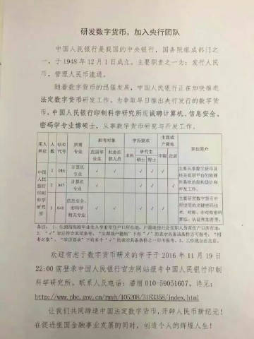

# TAG_加密货币(15)

####  [tombkeeper](https://weibo.com/101174?refer_flag=1005055015_)

[2月28日 10:58](https://weibo.com/1401527553/G5bmsm9DI?from=page_1005051401527553_profile&wvr=6&mod=weibotime) 来自 [微博 weibo.com](http://app.weibo.com/t/feed/6vtZb0)

任何物质产权都需要暴力机器背书。而暴力机器不会“去中心”。除非“共识”能直接产生暴力，或人类社会演变为不需要物质的形态，否则社会纯靠“共识”是不可能运作的。而即使“共识”能直接产生暴力，暴力机器也不可能坐视这个过程。无中心的暴力绝不可能和暴力机器对抗。这叫“兰彻斯特方程教做人”。 

标签： [定期renew](https://weibo.com/1401527553/profile?is_tag=1&tag_name=%E5%AE%9A%E6%9C%9Frenew) [加密货币](https://weibo.com/1401527553/profile?is_tag=1&tag_name=%E5%8A%A0%E5%AF%86%E8%B4%A7%E5%B8%81)

#### [tombkeeper](https://weibo.com/101174?refer_flag=1005055015_)

[2月23日 13:36](https://weibo.com/1401527553/G4rfUr2dc?from=page_1005051401527553_profile&wvr=6&mod=weibotime) 来自 [微博 weibo.com](http://app.weibo.com/t/feed/6vtZb0) 已编辑

一个算力 1000PH 的比特币矿池，每秒可以产生 1000*2^50 个 SHA256 碰撞，
也就是：1.12589990684262e+18
由大小写字母、数字、符号组成的 8 位密码的可能性总数是 (10+26*2+30)^8，
也就是：5.13218873137562e+15 

标签： [加密货币](https://weibo.com/1401527553/profile?is_tag=1&tag_name=%E5%8A%A0%E5%AF%86%E8%B4%A7%E5%B8%81) [信息安全](https://weibo.com/1401527553/profile?is_tag=1&tag_name=%E4%BF%A1%E6%81%AF%E5%AE%89%E5%85%A8)

#### [tombkeeper](https://weibo.com/101174?refer_flag=1005055015_)

[1月31日 18:58](https://weibo.com/1401527553/G0Yx89zTq?from=page_1005051401527553_profile&wvr=6&mod=weibotime) 来自 [微博 weibo.com](http://app.weibo.com/t/feed/6vtZb0)

有人说妹子问他 “sudo rm -rf /” 是干嘛用的。我说你可以告诉她是挖比特币用的，只要输入这个命令，电脑就会开始挖硬盘上的比特，挖出来就是比特币。 

标签： [笑话](https://weibo.com/1401527553/profile?is_tag=1&tag_name=%E7%AC%91%E8%AF%9D) [加密货币](https://weibo.com/1401527553/profile?is_tag=1&tag_name=%E5%8A%A0%E5%AF%86%E8%B4%A7%E5%B8%81)

#### [tombkeeper](https://weibo.com/101174?refer_flag=1005055015_)

[2017-12-28 12:36](https://weibo.com/1401527553/FBIXwEVnA?from=page_1005051401527553_profile&wvr=6&mod=weibotime) 来自 [微博 weibo.com](http://app.weibo.com/t/feed/6vtZb0)

看了一下大家的提问，问的最多的是比特币。问这个是很不明智的。你们想想：如果一个人会点石成金，他是在家偷偷造金子呢，还是办培训班教点金术赚学费？再说，花 42 块钱就想学到发财的本事，怎么可能。42 块钱只能获得宇宙终极真理。 

标签： [加密货币](https://weibo.com/1401527553/profile?is_tag=1&tag_name=%E5%8A%A0%E5%AF%86%E8%B4%A7%E5%B8%81)

#### [tombkeeper](https://weibo.com/101174?refer_flag=1005055015_)

[2016-11-15 10:29](https://weibo.com/1401527553/EhDdUF6ba?from=page_1005051401527553_profile&wvr=6&mod=weibotime) 来自 [微博 weibo.com](http://app.weibo.com/t/feed/6vtZb0)

看来官方版比特币在筹划中了。不过任何国家的政府搞这个，都肯定不会是去中心化而一定是强中心化的，每笔交易皆可追踪。 

标签： [加密货币](https://weibo.com/1401527553/profile?is_tag=1&tag_name=%E5%8A%A0%E5%AF%86%E8%B4%A7%E5%B8%81)

#### [tombkeeper](https://weibo.com/101174?refer_flag=1005055015_)

[2016-8-21 11:24](https://weibo.com/1401527553/E4yPk1p6O?from=page_1005051401527553_profile&wvr=6&mod=weibotime) 来自 [微博 weibo.com](http://app.weibo.com/t/feed/6vtZb0)

Shadow Brokers 要价一百万比特币看起来很夸张，但放在军费里看，也就几架 F35。攻击工具能值那么多钱吗？一般的自然不行，但如果能攻击世界上大部分骨干路由器数据平面呢？如果能攻击世界上大部分手机基带呢？如果包含苹果/微软的私钥呢？ 

标签： [加密货币](https://weibo.com/1401527553/profile?is_tag=1&tag_name=%E5%8A%A0%E5%AF%86%E8%B4%A7%E5%B8%81)

#### [tombkeeper](https://weibo.com/101174?refer_flag=1005055015_)

[2016-1-3 21:49](https://weibo.com/1401527553/DbsEYfymr?from=page_1005051401527553_profile&wvr=6&mod=weibotime) 来自 [微博 weibo.com](http://weibo.com/)

我记得很久以前看过一个老外的演讲，叫《为什么政府恨现金》——因为现金相对于支票和信用卡来说，难以追踪。现在这个演讲应该升级成《为什么政府恨比特币》了。 

标签： [加密货币](https://weibo.com/1401527553/profile?is_tag=1&tag_name=%E5%8A%A0%E5%AF%86%E8%B4%A7%E5%B8%81)

#### [tombkeeper](https://weibo.com/101174?refer_flag=1005055015_)

[2014-3-6 12:19](https://weibo.com/1401527553/AzHOE6g7E?from=page_1005051401527553_profile&wvr=6&mod=weibotime) 来自 [微博 weibo.com](http://weibo.com/)

网上有一条流言，说从Mt.Gox偷了85万比特币（约4.67亿美元）的入侵者，“MAC地址位于上海陆家嘴未来资产大厦楼内”。有人觉得这句话有问题，认为MAC地址无法用于定位，所谓“MAC”地址可能是指IP地址。推荐有同样疑惑的朋友看一下我去年的这篇短文：[*O*网页链接](http://weibo.com/1401527553/zFkYOqgMC) 。 

标签： [加密货币](https://weibo.com/1401527553/profile?is_tag=1&tag_name=%E5%8A%A0%E5%AF%86%E8%B4%A7%E5%B8%81)

#### [tombkeeper](https://weibo.com/101174?refer_flag=1005055015_)

[2014-3-5 14:46](https://weibo.com/1401527553/AzzlH9jdN?from=page_1005051401527553_profile&wvr=6&mod=weibotime) 来自 [微博 weibo.com](http://weibo.com/)

1、甭管什么网站，总有办法入侵，区别只是成本高低。2、100万美元成本可以入侵世界上几乎所有网站。3、如果投入100万可以获得1000万匿名资产，这事就有人愿意干。以上三点，是比特币交易网站面临的最大问题，也是比特币面临的最大问题。 

标签： [加密货币](https://weibo.com/1401527553/profile?is_tag=1&tag_name=%E5%8A%A0%E5%AF%86%E8%B4%A7%E5%B8%81) [信息安全](https://weibo.com/1401527553/profile?is_tag=1&tag_name=%E4%BF%A1%E6%81%AF%E5%AE%89%E5%85%A8) [APT](https://weibo.com/1401527553/profile?is_tag=1&tag_name=APT)

#### [tombkeeper](https://weibo.com/101174?refer_flag=1005055015_)

[2014-1-10 09:27](https://weibo.com/1401527553/ArkbCaMCb?from=page_1005051401527553_profile&wvr=6&mod=weibotime) 来自 [微博 weibo.com](http://weibo.com/)

看到有人说他拿了DARPA的资助，研究可以在人的血流中运行的纳米计算机。无家可归的穷人身上安装这种机器后就可以给自己挖比特币买食物…… 

标签： [加密货币](https://weibo.com/1401527553/profile?is_tag=1&tag_name=%E5%8A%A0%E5%AF%86%E8%B4%A7%E5%B8%81)

#### [tombkeeper](https://weibo.com/101174?refer_flag=1005055015_)

[2014-1-7 14:30](https://weibo.com/1401527553/AqTT6cIoC?from=page_1005051401527553_profile&wvr=6&mod=weibotime) 来自 [微博 weibo.com](http://weibo.com/)

无厘头上联：养比特犬，挖比特币，谁比特里更有资格当队长？ 

标签： [笑话](https://weibo.com/1401527553/profile?is_tag=1&tag_name=%E7%AC%91%E8%AF%9D) [加密货币](https://weibo.com/1401527553/profile?is_tag=1&tag_name=%E5%8A%A0%E5%AF%86%E8%B4%A7%E5%B8%81)

#### [tombkeeper](https://weibo.com/101174?refer_flag=1005055015_)

[2013-12-2 21:20](https://weibo.com/1401527553/Altbsa3qN?from=page_1005051401527553_profile&wvr=6&mod=weibotime) 来自 [微博 weibo.com](http://weibo.com/)

不知道买山寨币亏了的人会不会去要求政府主持公道还我血汗。 

标签： [加密货币](https://weibo.com/1401527553/profile?is_tag=1&tag_name=%E5%8A%A0%E5%AF%86%E8%B4%A7%E5%B8%81)

#### [tombkeeper](https://weibo.com/101174?refer_flag=1005055015_)

[2013-11-21 15:35](https://weibo.com/1401527553/AjLec2zja?from=page_1005051401527553_profile&wvr=6&mod=weibotime) 来自 [iPhone客户端](http://app.weibo.com/t/feed/9ksdit)

接下来就等着看哪儿的妓女率先宣布接受比特币付款了。我猜是领天下风气之先的阿姆斯特丹。 

标签： [加密货币](https://weibo.com/1401527553/profile?is_tag=1&tag_name=%E5%8A%A0%E5%AF%86%E8%B4%A7%E5%B8%81)

#### [tombkeeper](https://weibo.com/101174?refer_flag=1005055015_)

[2013-11-18 11:37](https://weibo.com/1401527553/Ajhodwovo?from=page_1005051401527553_profile&wvr=6&mod=weibotime) 来自 [微博 weibo.com](http://weibo.com/)

比特币的匿名性、不可追踪性和不受监管性，最终可能会因为信息安全方面的威胁而做出某种妥协。 

标签： [加密货币](https://weibo.com/1401527553/profile?is_tag=1&tag_name=%E5%8A%A0%E5%AF%86%E8%B4%A7%E5%B8%81) [信息安全](https://weibo.com/1401527553/profile?is_tag=1&tag_name=%E4%BF%A1%E6%81%AF%E5%AE%89%E5%85%A8)

#### [tombkeeper](https://weibo.com/101174?refer_flag=1005055015_)

[2013-4-2 12:21](https://weibo.com/1401527553/zqgQ2mBF7?from=page_1005051401527553_profile&wvr=6&mod=weibotime) 来自 [微博 weibo.com](http://weibo.com/)

比特币两周翻一番突破100美元的消息，估计要激发不少码农学习FPGA的热情![[哈哈]](TAG_加密货币.assets/2018new_haha_org.png)。这东西对网络犯罪的洗钱价值就不用说了，也赋予了botnet一个额外赚钱途径——没有其它活儿的空闲时间挣点小钱也不赖。因为创造比特币只需要运算资源而不需要控制系统，所以可能会出现在网站挂Javascript的挖矿方式。 

标签： [加密货币](https://weibo.com/1401527553/profile?is_tag=1&tag_name=%E5%8A%A0%E5%AF%86%E8%B4%A7%E5%B8%81) [信息安全](https://weibo.com/1401527553/profile?is_tag=1&tag_name=%E4%BF%A1%E6%81%AF%E5%AE%89%E5%85%A8)

