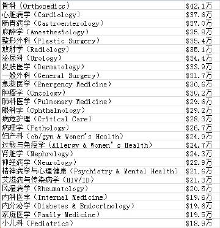
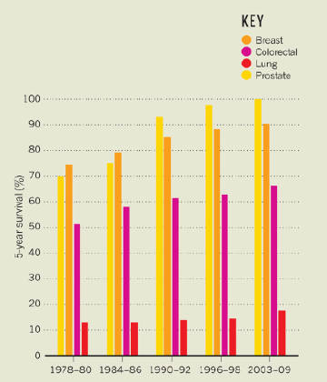

#  TAG_医学(40)

### [tombkeeper](https://weibo.com/101174?refer_flag=1005055015_)  

[2月21日 10:58](https://weibo.com/1401527553/G47mNvoBS?from=page_1005051401527553_profile&wvr=6&mod=weibotime) 来自 [微博 weibo.com](http://app.weibo.com/t/feed/6vtZb0)

前阵子发现默克诊疗手册又上线了，而且较之前做了很大改版，更便于查阅。这可能是中文互联网世界最全面、最权威、最体系化的医学资料了。再次推荐：[*O*网页链接](http://t.cn/REvz2fj) 

标签： [医学](https://weibo.com/1401527553/profile?is_tag=1&tag_name=%E5%8C%BB%E5%AD%A6)

-------

### [tombkeeper](https://weibo.com/101174?refer_flag=1005055015_)  

[2017-5-22 16:16](https://weibo.com/1401527553/F4inOpNCC?from=page_1005051401527553_profile&wvr=6&mod=weibotime) 来自 [微博 weibo.com](http://app.weibo.com/t/feed/6vtZb0)

祖国传统医学到底是瑰宝还是糟粕，主要看能不能活学活用。比如别人劝我夏天别开空调，借助祖国传统医学，三个字问题就解决了：
“我宫热” 

标签： [笑话](https://weibo.com/1401527553/profile?is_tag=1&tag_name=%E7%AC%91%E8%AF%9D) [医学](https://weibo.com/1401527553/profile?is_tag=1&tag_name=%E5%8C%BB%E5%AD%A6)

-------

### [tombkeeper](https://weibo.com/101174?refer_flag=1005055015_)  

[2016-11-5 23:56](https://weibo.com/1401527553/EgceGfsGV?from=page_1005051401527553_profile&wvr=6&mod=weibotime)

一个同学说他上门诊时白大褂兜里常装点零钱。因为会有病人被诊断后发现实际上是另一科室的病，就要求他退挂号费。有一次他退了 20 元挂号费，病人想了想，又找给他 10 元，说：“我也有责任，就一人一半吧”。 

标签： [医学](https://weibo.com/1401527553/profile?is_tag=1&tag_name=%E5%8C%BB%E5%AD%A6)

-------

### [tombkeeper](https://weibo.com/101174?refer_flag=1005055015_)  

[2016-6-14 11:17](https://weibo.com/1401527553/DAbbffIiK?from=page_1005051401527553_profile&wvr=6&mod=weibotime) 来自 [iPhone 6s Plus](http://app.weibo.com/t/feed/5B6hUc)

娃的药吃完了，老婆去医院开。医生跟我老婆说他们没有那种药，因为他们认为三代头孢比二代、一代高级，所以他们医院现在只进三代头孢。![[笑cry]](rwar.assets/2018new_xiaoku_org-1525539877574.png)![[笑cry]](rwar.assets/2018new_xiaoku_org-1525539877574.png)![[笑cry]](rwar.assets/2018new_xiaoku_org-1525539877574.png) 

标签： [医学](https://weibo.com/1401527553/profile?is_tag=1&tag_name=%E5%8C%BB%E5%AD%A6)

-------

### [tombkeeper](https://weibo.com/101174?refer_flag=1005055015_)  

[2016-6-10 10:19](https://weibo.com/1401527553/Dzz5LDSaC?from=page_1005051401527553_profile&wvr=6&mod=weibotime) 来自 [微博 weibo.com](http://weibo.com/)

民间有拿金戒指煮水治小孩受惊夜哭的偏方。这不是野路子，《本草纲目》说：“食金，镇精神” 。而且有时确实奏效。怎么奏效的呢？黄金里可能含汞，小孩喝了后中毒犯迷糊，就“安神”了。《中国小儿急救医学》2006年5期记载了一个祖母用金戒指煮水喂孩子引起心脏、肝脏损伤的病例：[*O*网页链接](http://t.cn/zHaBXJb) 

标签： [医学](https://weibo.com/1401527553/profile?is_tag=1&tag_name=%E5%8C%BB%E5%AD%A6)

-------

### [tombkeeper](https://weibo.com/101174?refer_flag=1005055015_)  

[2016-3-5 19:41](https://weibo.com/1401527553/DkSjMq071?from=page_1005051401527553_profile&wvr=6&mod=weibotime) 来自 [微博 weibo.com](http://weibo.com/)

现代医学，借助工业文明和信息文明，让少数极出色的人——就是那些发明新药、发明仪器，探明病理，创造术式、创造治疗方法的人——的工作成果，变得可复制，可以让很多人享受。所以部分医生的平庸，常常会被现代医学的伟大所掩盖。所以下一步，也许是考虑怎么让那些优秀的医生的工作可以服务更多的人。 

标签： [定期renew](https://weibo.com/1401527553/profile?is_tag=1&tag_name=%E5%AE%9A%E6%9C%9Frenew) [医学](https://weibo.com/1401527553/profile?is_tag=1&tag_name=%E5%8C%BB%E5%AD%A6)

-------

### [tombkeeper](https://weibo.com/101174?refer_flag=1005055015_)  

[2016-1-20 20:24](https://weibo.com/1401527553/De2mztYvJ?from=page_1005051401527553_profile&wvr=6&mod=weibotime) 来自 [微博 weibo.com](http://weibo.com/)

关于美国医生的收入。MedScape 调查了 26 个医疗专业，共 1.95 万名医生在 2014 年的年收入，发布了“Physician Compensation Report 2015”“：[*O*网页链接](http://t.cn/R48tlPs) 。数据如图。这个报告是把各年资的医生放在一起算，所以看不出美国年轻医生的收入情况。 

标签： [医学](https://weibo.com/1401527553/profile?is_tag=1&tag_name=%E5%8C%BB%E5%AD%A6)

-------

### [tombkeeper](https://weibo.com/101174?refer_flag=1005055015_)  

[2015-12-3 20:04](https://weibo.com/1401527553/D6JICr8RE?from=page_1005051401527553_profile&wvr=6&mod=weibotime) 来自 [微博 weibo.com](http://weibo.com/)

关于乙肝，如果自己会利用网络了解不懂的术语，我推荐阅读斯坦福大学亚裔肝脏中心的《乙型肝炎防治医生手册》[*O*网页链接](http://t.cn/RUkDVmT)，详细全面而又简明扼要。 

标签： [定期renew](https://weibo.com/1401527553/profile?is_tag=1&tag_name=%E5%AE%9A%E6%9C%9Frenew) [医学](https://weibo.com/1401527553/profile?is_tag=1&tag_name=%E5%8C%BB%E5%AD%A6)

-------

### [tombkeeper](https://weibo.com/101174?refer_flag=1005055015_)  

[2015-12-3 12:17](https://weibo.com/1401527553/D6GF48u0J?from=page_1005051401527553_profile&wvr=6&mod=weibotime) 来自 [微博 weibo.com](http://weibo.com/)

广州中医药大学的中医博士栾加芹（[*O*网页链接](http://t.cn/S27ndV)）根据《易经》分析认为新生儿注射乙肝疫苗是“打着科学的旗号，摧残孩子”：[*O*网页链接](http://t.cn/RUklk3T) 

标签： [医学](https://weibo.com/1401527553/profile?is_tag=1&tag_name=%E5%8C%BB%E5%AD%A6)

-------

### [tombkeeper](https://weibo.com/101174?refer_flag=1005055015_)  

[2015-10-5 19:01](https://weibo.com/1401527553/CDIyexQpj?from=page_1005051401527553_profile&wvr=6&mod=weibotime) 来自 [微博 weibo.com](http://weibo.com/)

很巧，一周前腾讯《大家》刊载了一篇文章（[*O*“我是一名中医，也是一名医生，治病救人是本...](http://t.cn/RyCk1WK) ），写了一个援助非洲的中医，因为坚持“救助别的病人我会优先选择最有效、最可靠的方法”，所以在当地推荐青蒿素。但自己患疟疾后，因为“我不能允许自己接受中医以外的疗法”，所以不愿注射青蒿素，最终以身殉道。这我觉是个人物。 

标签： [医学](https://weibo.com/1401527553/profile?is_tag=1&tag_name=%E5%8C%BB%E5%AD%A6)

-------

### [tombkeeper](https://weibo.com/101174?refer_flag=1005055015_)  

[2015-1-17 10:42](https://weibo.com/1401527553/BFWcrAuEx?from=page_1005051401527553_profile&wvr=6&mod=weibotime) 来自 [微博 weibo.com](http://weibo.com/)

《Nature》杂志去年有一篇谈癌症流行病学，其中提到由于诊疗技术的进步，前列腺癌和乳腺癌的五年生存率近几十年进步很快，现在都有 90% 左右。我国整体上比英美这样的国家要差一些，但大城市和他们比差的也不多。如果相信科学，愿意接受英美病人所接受的现代医学治疗，中国人也可以享受科技进步成果。 

标签： [定期renew](https://weibo.com/1401527553/profile?is_tag=1&tag_name=%E5%AE%9A%E6%9C%9Frenew) [医学](https://weibo.com/1401527553/profile?is_tag=1&tag_name=%E5%8C%BB%E5%AD%A6)

-------

### [tombkeeper](https://weibo.com/101174?refer_flag=1005055015_)  

[2014-11-29 18:41](https://weibo.com/1401527553/ByxoGnh1j?from=page_1005051401527553_profile&wvr=6&mod=weibotime) 来自 [iPhone 5s](http://app.weibo.com/t/feed/3G5oUM)

今天见了几个老同学，有一个也是学医的。席间另一人说起媳妇坐月子时，医生说要喝公鸡汤不能喝母鸡汤，因为母鸡有雌激素，云云。他毅然说了一句：“这没有循证证据”。他的表达方式并没有考虑受众，但至少是个合格的受过科学训练的医生。 

标签： [医学](https://weibo.com/1401527553/profile?is_tag=1&tag_name=%E5%8C%BB%E5%AD%A6)

-------

### [tombkeeper](https://weibo.com/101174?refer_flag=1005055015_)  

[2014-8-17 09:48](https://weibo.com/1401527553/BiFsufsmQ?from=page_1005051401527553_profile&wvr=6&mod=weibotime) 来自 [微博 weibo.com](http://weibo.com/)

体检是流水线作业，医生也是活人，一些人为因素较强的项目检查效果和医生情绪有很大关系。1、去早点。你之前要是已经查过四五十人，医生多少会有些麻木。2、客气点。进门给个笑脸，说声“您好”，绝大多数人没这习惯。3、主动点。该躺下躺下，该张嘴张嘴，别等医生说，谁都不愿意一遍遍重复那几句话。 

标签： [定期renew](https://weibo.com/1401527553/profile?is_tag=1&tag_name=%E5%AE%9A%E6%9C%9Frenew) [医学](https://weibo.com/1401527553/profile?is_tag=1&tag_name=%E5%8C%BB%E5%AD%A6)

-------

### [tombkeeper](https://weibo.com/101174?refer_flag=1005055015_)  

[2014-8-12 21:37](https://weibo.com/1401527553/BhYXSj1Jj?from=page_1005051401527553_profile&wvr=6&mod=weibotime) 来自 [微博 weibo.com](http://weibo.com/)

谁尝百草走遍天涯，谁包治百病把海口夸？谁妙手仁心华佗世家，谁往灵丹里掺二甲双胍？ 

标签： [定期renew](https://weibo.com/1401527553/profile?is_tag=1&tag_name=%E5%AE%9A%E6%9C%9Frenew) [医学](https://weibo.com/1401527553/profile?is_tag=1&tag_name=%E5%8C%BB%E5%AD%A6)

-------

### [tombkeeper](https://weibo.com/101174?refer_flag=1005055015_)  

[2014-7-27 12:33](https://weibo.com/1401527553/Bfuz1gjJs?from=page_1005051401527553_profile&wvr=6&mod=weibotime) 来自 [微博 weibo.com](http://weibo.com/)

在一本高上大杂志上看到一篇《那些容易被忽视的健康忠告》，第一句是：“听取来自医生的简明扼要的健康忠告，要比偏信民间偏方靠谱得多”，然后开始谈喝牛奶的危害、喝咖啡的危害、喝水的危害、不能用热水吃药等。有钱人身边的信息流被这类东西占据，难怪。 

标签： [定期renew](https://weibo.com/1401527553/profile?is_tag=1&tag_name=%E5%AE%9A%E6%9C%9Frenew) [医学](https://weibo.com/1401527553/profile?is_tag=1&tag_name=%E5%8C%BB%E5%AD%A6)

-------

### [tombkeeper](https://weibo.com/101174?refer_flag=1005055015_)  

[2014-5-9 12:30](https://weibo.com/1401527553/B3tMvoiVc?from=page_1005051401527553_profile&wvr=6&mod=weibotime) 来自 [微博 weibo.com](http://weibo.com/)

你们知道我一般只是“推荐阅读”，偶尔才会“强烈推荐阅读”，这个是强烈推荐阅读：《一个硬币的另一面——美国看病记》[*O*网页链接](http://t.cn/8sr3PW6)。 

标签： [备用](https://weibo.com/1401527553/profile?is_tag=1&tag_name=%E5%A4%87%E7%94%A8) [医学](https://weibo.com/1401527553/profile?is_tag=1&tag_name=%E5%8C%BB%E5%AD%A6)

-------

### [tombkeeper](https://weibo.com/101174?refer_flag=1005055015_)  

[2014-4-18 16:09](https://weibo.com/1401527553/B0jf0lgDg?from=page_1005051401527553_profile&wvr=6&mod=weibotime) 来自 [微博 weibo.com](http://weibo.com/)

世界卫生组织 2014-4-17 消息：东南亚出现首个感染该病毒并死亡的病例，感染者在去沙特朝圣期间曾引用骆驼奶。该病毒目前被认为由骆驼传染给人，尚无人际间传播的证据。

[@tombkeeper](https://weibo.com/101174?refer_flag=1005055015_)

NBCNews.com：法国政府确认：去年在中东地区出现的新型冠状病毒，已经有了第一个输入到法国的病例。这种新型病毒被认为是“related to SARS”。新型病毒传染性比SARS低（去年9月至今只有30个病例），致死率比SARS高（30个病例中已有18人死亡）。 

[2013-5-9 23:07](https://weibo.com/1401527553/zvXSLEoiI) 来自 [微博 weibo.com](http://weibo.com/)

标签： [医学](https://weibo.com/1401527553/profile?is_tag=1&tag_name=%E5%8C%BB%E5%AD%A6)

-------

### [tombkeeper](https://weibo.com/101174?refer_flag=1005055015_)  

[2014-4-3 15:34](https://weibo.com/1401527553/ADZ3XkkxK?from=page_1005051401527553_profile&wvr=6&mod=weibotime) 来自 [微博 weibo.com](http://weibo.com/)

推荐阅读：宋友谅《我对“云南白药”的观察》 [*O*网页链接](http://t.cn/zYCzn2v) 

标签： [医学](https://weibo.com/1401527553/profile?is_tag=1&tag_name=%E5%8C%BB%E5%AD%A6)

-------

### [tombkeeper](https://weibo.com/101174?refer_flag=1005055015_)  

[2014-3-30 21:19](https://weibo.com/1401527553/ADpC1eZ2G?from=page_1005051401527553_profile&wvr=6&mod=weibotime) 来自 [微博 weibo.com](http://weibo.com/)

我以前说过，喜欢计算机的一个重要原因是万事皆可“printf”，不用扯皮扯蛋扯犊子。如果你是医生，有不同意见，“主任，我觉得应该换个方案”，然后你就完蛋了，你没法证明自己是对的。而即使再遇到一个病人用你的方案更佳，也无法证明前一次你是对的。计算机就简单了，写个程序试一下，结果人人可见。 

标签： [定期renew](https://weibo.com/1401527553/profile?is_tag=1&tag_name=%E5%AE%9A%E6%9C%9Frenew) [医学](https://weibo.com/1401527553/profile?is_tag=1&tag_name=%E5%8C%BB%E5%AD%A6)

-------

### [tombkeeper](https://weibo.com/101174?refer_flag=1005055015_)  

[2013-12-4 19:51](https://weibo.com/1401527553/AlLspk0PS?from=page_1005051401527553_profile&wvr=6&mod=weibotime) 来自 [微博 weibo.com](http://weibo.com/)

小区里有个两岁的孩子，眼圈有些青，家里人带去看中医，中医说是积食。现在孩子已经喝了几个月中药。我本来想推荐他们试试雅诗兰黛莹粹亮彩眼影，后来忍了。 

标签： [笑话](https://weibo.com/1401527553/profile?is_tag=1&tag_name=%E7%AC%91%E8%AF%9D) [定期renew](https://weibo.com/1401527553/profile?is_tag=1&tag_name=%E5%AE%9A%E6%9C%9Frenew) [医学](https://weibo.com/1401527553/profile?is_tag=1&tag_name=%E5%8C%BB%E5%AD%A6)

-------

### [tombkeeper](https://weibo.com/101174?refer_flag=1005055015_)  

[2013-7-27 09:52](https://weibo.com/1401527553/A1VYKoBu2?from=page_1005051401527553_profile&wvr=6&mod=weibotime) 来自 [微博 weibo.com](http://weibo.com/)

老婆怀孕时要求每天喝米酒，因为“很多人都这么说”。我告诉她酒精会伤害胎儿，并让她去问“很多人”糖尿病是不是因为爱吃糖。她在QQ上一问，果然大家都说是的。于是她终于明白“很多人”的不可信。不过生完孩子医院赠的冰激凌蛋糕她可没放过。我打算以“月子里不能吃凉的”说服她让给我吃，没有得逞。 

标签： [定期renew](https://weibo.com/1401527553/profile?is_tag=1&tag_name=%E5%AE%9A%E6%9C%9Frenew) [医学](https://weibo.com/1401527553/profile?is_tag=1&tag_name=%E5%8C%BB%E5%AD%A6)

-------

### [tombkeeper](https://weibo.com/101174?refer_flag=1005055015_)  

[2013-6-25 10:18](https://weibo.com/1401527553/zD1VJv2u7?from=page_1005051401527553_profile&wvr=6&mod=weibotime) 来自 [微博 weibo.com](http://weibo.com/)

昨晚看了一些求医问诊类社区医生们对儿童疱疹性咽峡炎给出的建议，退烧药+抗生素+中药冲剂+中药喷剂看来是业界标准，也有建议去医院输液的。 

标签： [定期renew](https://weibo.com/1401527553/profile?is_tag=1&tag_name=%E5%AE%9A%E6%9C%9Frenew) [医学](https://weibo.com/1401527553/profile?is_tag=1&tag_name=%E5%8C%BB%E5%AD%A6)

-------

### [tombkeeper](https://weibo.com/101174?refer_flag=1005055015_)  

[2013-5-14 21:42](https://weibo.com/1401527553/zwIsEkreN?from=page_1005051401527553_profile&wvr=6&mod=weibotime) 来自 [微博 weibo.com](http://weibo.com/)

根据卫计委统计，截止至5月13日，中国共有130人感染H7N9禽流感，其中35人死亡。算下来死亡率约27%。 

标签： [医学](https://weibo.com/1401527553/profile?is_tag=1&tag_name=%E5%8C%BB%E5%AD%A6)

-------

### [tombkeeper](https://weibo.com/101174?refer_flag=1005055015_)  

[2013-5-12 20:53](https://weibo.com/1401527553/zwphMbRzF?from=page_1005051401527553_profile&wvr=6&mod=weibotime) 来自 [微博 weibo.com](http://weibo.com/)

法新社：出现症状的三人中，同病房的病友已经确诊是感染了冠状病毒。

[@tombkeeper](https://weibo.com/101174?refer_flag=1005055015_)

法新社：上周三那个新型冠状病毒患者（[*O*网页链接](http://weibo.com/1401527553/zvXSLEoiI)）的医生、护士、同病房的病友共三人都出现了明显的呼吸道强烈感染和发烧症状。（这可能意味着这种致死率很高的病毒已经具有了人传人的能力。） 

[2013-5-11 12:58](https://weibo.com/1401527553/zwcKpjE8H) 来自 [微博 weibo.com](http://weibo.com/)

标签： [医学](https://weibo.com/1401527553/profile?is_tag=1&tag_name=%E5%8C%BB%E5%AD%A6)

-------

### [tombkeeper](https://weibo.com/101174?refer_flag=1005055015_)  

[2013-5-9 23:07](https://weibo.com/1401527553/zvXSLEoiI?from=page_1005051401527553_profile&wvr=6&mod=weibotime) 来自 [微博 weibo.com](http://weibo.com/)

NBCNews.com：法国政府确认：去年在中东地区出现的新型冠状病毒，已经有了第一个输入到法国的病例。这种新型病毒被认为是“related to SARS”。新型病毒传染性比SARS低（去年9月至今只有30个病例），致死率比SARS高（30个病例中已有18人死亡）。 

标签： [医学](https://weibo.com/1401527553/profile?is_tag=1&tag_name=%E5%8C%BB%E5%AD%A6)

-------

### [tombkeeper](https://weibo.com/101174?refer_flag=1005055015_)  

[2013-2-24 23:17](https://weibo.com/1401527553/zkIjM5tBv?from=page_1005051401527553_profile&wvr=6&mod=weibotime) 来自 [微博 weibo.com](http://weibo.com/)

很多人认为空气污染只影响肺，其实远没那么简单。媒体和写科普的朋友，如果需要参考资料，可以读一下这篇论文：[*O*网页链接](http://t.cn/zY0xV0p)。北京大学公共卫生学院的研究人员对若干名出租车司机在2008年奥运会前、中、后的心律变异性进行了跟踪，得出PM2.5中金属成分含量和心脏植物神经功能明显相关的结论。 

标签： [医学](https://weibo.com/1401527553/profile?is_tag=1&tag_name=%E5%8C%BB%E5%AD%A6)

-------

### [tombkeeper](https://weibo.com/101174?refer_flag=1005055015_)  

[2013-2-22 15:09](https://weibo.com/1401527553/zkmgUqhFQ?from=page_1005051401527553_profile&wvr=6&mod=weibotime) 来自 [微博 weibo.com](http://weibo.com/)

谈到间接接触感染性病，说个病例：一个朋友得了阴道滴虫，但想不出怎么感染的，就偷偷来问我。我说理论上可能从你男人那里感染，但我们都不信她男人会寻花问柳，而且她男人毫无症状。然后我帮她一点一点分析，发现她常去健身房，健身完了洗澡，洗完澡光腚坐在一个公用凳子上穿衣服！这可能就是原因。 

标签： [医学](https://weibo.com/1401527553/profile?is_tag=1&tag_name=%E5%8C%BB%E5%AD%A6)

-------

### [tombkeeper](https://weibo.com/101174?refer_flag=1005055015_)  

[2013-1-7 11:56](https://weibo.com/1401527553/zdllKuNFY?from=page_1005051401527553_profile&wvr=6&mod=weibotime) 来自 [微博 weibo.com](http://weibo.com/)

具体到这件事，是医生没有提出要化验，可能也没往阑尾炎上考虑。但借此想提醒各位家长的是：如果医生提出要化验，特别是涉及抽血、腰穿之类的化验，请不要拒绝。有些孩子症状就是不典型。即使典型，也可能因为孩子的描述有误影响判断。

[@tombkeeper](https://weibo.com/101174?refer_flag=1005055015_)

朋友孩子前两天腹痛、呕吐、发热，就医按急性肠胃炎处理。后因缓解不明显再次就医，大概打了一针止吐药。昨天他说起时，我问这两次有没有做任何化验，他说没有，我让他再去医院。结果发现是阑尾炎，已经穿孔了，刚做完手术。不知道前两次医生有没有针对阑尾炎检体，但至少第二次就医时应该验个血常规。 

[2013-1-7 11:00](https://weibo.com/1401527553/zdkZ3D2zm) 来自 [微博 weibo.com](http://weibo.com/)

标签： [医学](https://weibo.com/1401527553/profile?is_tag=1&tag_name=%E5%8C%BB%E5%AD%A6)

-------

### [tombkeeper](https://weibo.com/101174?refer_flag=1005055015_)  

[2013-1-7 11:00](https://weibo.com/1401527553/zdkZ3D2zm?from=page_1005051401527553_profile&wvr=6&mod=weibotime) 来自 [微博 weibo.com](http://weibo.com/)

朋友孩子前两天腹痛、呕吐、发热，就医按急性肠胃炎处理。后因缓解不明显再次就医，大概打了一针止吐药。昨天他说起时，我问这两次有没有做任何化验，他说没有，我让他再去医院。结果发现是阑尾炎，已经穿孔了，刚做完手术。不知道前两次医生有没有针对阑尾炎检体，但至少第二次就医时应该验个血常规。 

标签： [医学](https://weibo.com/1401527553/profile?is_tag=1&tag_name=%E5%8C%BB%E5%AD%A6)

-------

### [tombkeeper](https://weibo.com/101174?refer_flag=1005055015_)  

[2013-1-5 14:13](https://weibo.com/1401527553/zd3ohz9Rx?from=page_1005051401527553_profile&wvr=6&mod=weibotime) 来自 [微博 weibo.com](http://weibo.com/)

〖你们中西医结合专业，招纳米技术的研究生干啥？〗【当然是为了搞中西医结合。】〖这俩怎么结合？〗【我中医之妙，全在君臣佐使。老夫打算研制一种能修复肾单位的纳米机器人，和马兜铃配伍，看那帮诋毁中医的人还怎么说！】 

标签： [笑话](https://weibo.com/1401527553/profile?is_tag=1&tag_name=%E7%AC%91%E8%AF%9D) [医学](https://weibo.com/1401527553/profile?is_tag=1&tag_name=%E5%8C%BB%E5%AD%A6)

-------

### [tombkeeper](https://weibo.com/101174?refer_flag=1005055015_)  

[2012-12-31 12:54](https://weibo.com/1401527553/zchJGzNvl?from=page_1005051401527553_profile&wvr=6&mod=weibotime) 来自 [微博 weibo.com](http://weibo.com/)

早晨打开QQ看到一条28号的消息：一个朋友说他孩子发烧，血常规结果单核细胞增高明显，医生怀疑肺炎，要拍胸片，他怕辐射，没让拍；医生开了希舒美和“猴枣散”，他发现希舒美是抗生素，没让孩子吃。这就属于非常准确地把能犯的错误都犯了。一上午他QQ都不在线，不知道孩子现在怎么样，但愿没事。 

标签： [医学](https://weibo.com/1401527553/profile?is_tag=1&tag_name=%E5%8C%BB%E5%AD%A6)

-------

### [tombkeeper](https://weibo.com/101174?refer_flag=1005055015_)  

[2012-12-5 17:00](https://weibo.com/1401527553/z8meOkGK7?from=page_1005051401527553_profile&wvr=6&mod=weibotime) 来自 [微博 weibo.com](http://weibo.com/)

中国古代曾认为“少女癫狂”是因为体内有虫，所以用面捏成阳具，探入阴道，将虫引出，病就能好转。实际上这可能是某些和性需求有关的精神病。古人用“冲喜”来对付“撞邪”，本质上差不多。西方也经历过这个朴素的认知过程：他们曾认为癔病是子宫瘀血引起的，所以请医生用手指伸进阴道按摩就能奏效。 

标签： [医学](https://weibo.com/1401527553/profile?is_tag=1&tag_name=%E5%8C%BB%E5%AD%A6)

-------

### [tombkeeper](https://weibo.com/101174?refer_flag=1005055015_)  

[2012-11-2 20:09](https://weibo.com/1401527553/z3mmUa0GC?from=page_1005051401527553_profile&wvr=6&mod=weibotime) 来自 [微博 weibo.com](http://weibo.com/)

假设你的孩子一直吃某品牌奶粉，一岁不到就发现性早熟，是不是应该集中精力找奶粉企业算帐？当然可以。还可以找尿布企业算账，找自来水公司算账，找童装厂家算账——或者，先带孩子去查查脑垂体。 

标签： [医学](https://weibo.com/1401527553/profile?is_tag=1&tag_name=%E5%8C%BB%E5%AD%A6)

-------

### [tombkeeper](https://weibo.com/101174?refer_flag=1005055015_)  

[2012-8-31 19:07](https://weibo.com/1401527553/yzJuUy0fi?from=page_1005051401527553_profile&wvr=6&mod=weibotime) 来自 [微博 weibo.com](http://weibo.com/)

前阵子一个朋友让我帮着看体检报告，我发现一处影像学结果高度提示可能有肿瘤，就对朋友说：今天别上班了，赶紧去医院检查，越快越好。今天病理结果出来，果然是。万幸是高分化的，治愈希望非常大。现在恶性肿瘤患者年轻化趋势明显，年轻人千万别认为这些都是多年后的事。 

标签： [医学](https://weibo.com/1401527553/profile?is_tag=1&tag_name=%E5%8C%BB%E5%AD%A6)

-------

### [tombkeeper](https://weibo.com/101174?refer_flag=1005055015_)  

[2012-6-23 20:25](https://weibo.com/1401527553/ypfwjC7ik?from=page_1005051401527553_profile&wvr=6&mod=weibotime) 来自 [微博 weibo.com](http://weibo.com/)

回复[@纯银V](https://weibo.com/n/%E7%BA%AF%E9%93%B6V?from=feed&loc=at): 至少美国医生工作量相当大，每周100小时很寻常。有的州甚至专门立法加以限制。美国医学院要么入学门槛高，要么淘汰率高，再加上好几十万刀的学费，从一开始就筛掉了很多明显干不了这行的人。当上医生后，高压力高收入。有钱，但也苦逼，所以医生的酗酒、吸毒、离婚、自杀比例都不低。 

标签： [医学](https://weibo.com/1401527553/profile?is_tag=1&tag_name=%E5%8C%BB%E5%AD%A6)

-------

### [tombkeeper](https://weibo.com/101174?refer_flag=1005055015_)  

[2012-6-19 17:04](https://weibo.com/1401527553/yoCuE4ts4?from=page_1005051401527553_profile&wvr=6&mod=weibotime) 来自 [微博 weibo.com](http://weibo.com/)

破除对“寒凉”的迷信，不是非得逼谁喝凉水。而是爱喝就喝，不爱喝就不喝。至于“体质”……我承认自己“体质”没她好。 

标签： [医学](https://weibo.com/1401527553/profile?is_tag=1&tag_name=%E5%8C%BB%E5%AD%A6)

-------

### [tombkeeper](https://weibo.com/101174?refer_flag=1005055015_)  

[2011-11-14 21:32](https://weibo.com/1401527553/xxsxlBIrr?from=page_1005051401527553_profile&wvr=6&mod=weibotime) 来自 [微博 weibo.com](http://weibo.com/)

和大家分享香港慈善组织泰山公德会提供的一些癌症方面的资料。1、《癌症医学知识》：[*O*404 - 找不到页面](http://t.cn/SAraIN)。这是科普性的，适合大多数人阅读。2、《治癌指南》：[*O*网页链接](http://t.cn/SAraIj)。一份非常不错的综合文档。阅读需要一定医学基础。3、《世界最新癌讯》：[*O*网页链接](http://t.cn/SAraIR)。适合专业人士参考。 

标签： [医学](https://weibo.com/1401527553/profile?is_tag=1&tag_name=%E5%8C%BB%E5%AD%A6)

-------

### [tombkeeper](https://weibo.com/101174?refer_flag=1005055015_)  

[2011-10-19 12:43](https://weibo.com/1401527553/xtrXQlVAN?from=page_1005051401527553_profile&wvr=6&mod=weibotime) 来自 [微博 weibo.com](http://weibo.com/)

[#你信中医还是西医#](https://huati.weibo.com/k/%E4%BD%A0%E4%BF%A1%E4%B8%AD%E5%8C%BB%E8%BF%98%E6%98%AF%E8%A5%BF%E5%8C%BB?from=501) 我觉得单纯信中医，或者相信单纯信西医，都是不合适、不理性、不成熟、不融入主流社会的。至少也应该信中西医结合。作为我个人来说，当然比你们更加成熟一些，所以我现在相信中西藏蒙苗医结合。未来，我还打算把玛雅医学、阿兹特克医学、苏美尔医学、巴比伦医学等都融入进来。 

 [你信中医还是西医](http://weibo.cn/pages/100808434391d7c4f88c199b90db9c2c4b8b17?m=3370190105226277&u=1401527553)

[参与讨论](javascript:void(0)) [*+*关注](javascript:void(0))

标签： [定期renew](https://weibo.com/1401527553/profile?is_tag=1&tag_name=%E5%AE%9A%E6%9C%9Frenew) [医学](https://weibo.com/1401527553/profile?is_tag=1&tag_name=%E5%8C%BB%E5%AD%A6)

-------

### [tombkeeper](https://weibo.com/101174?refer_flag=1005055015_)  

[2011-8-23 22:10](https://weibo.com/1401527553/xkQjC20EY?from=page_1005051401527553_profile&wvr=6&mod=weibotime) 来自 [微博 weibo.com](http://weibo.com/)

推荐一种处理轻微烫伤的方法。轻微烫伤，就是炒菜时胳膊碰到锅这种。发红，很疼，但没起泡。这在医学上叫一度烫伤。这种烫伤只要保护局部皮肤的湿润，疼痛可以很快止住，愈合也很快。大多数烫伤膏都是油性的，主要目的就是维持局部湿润。而比各种烫伤药膏都方便且不易蹭掉不污衣的就是贴一块纸胶布。 

标签： [医学](https://weibo.com/1401527553/profile?is_tag=1&tag_name=%E5%8C%BB%E5%AD%A6)

