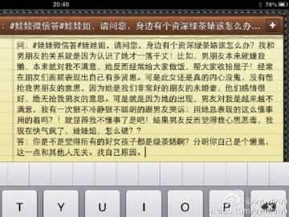
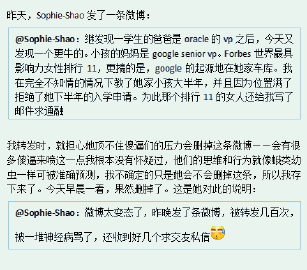
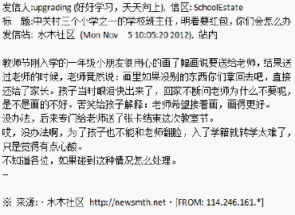
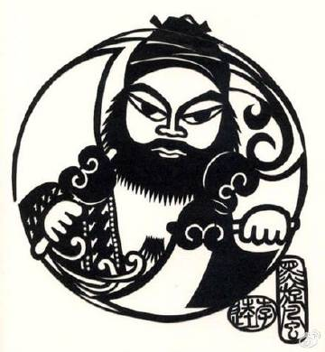
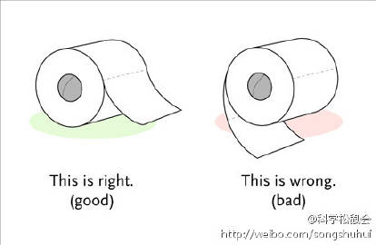

# TAG_地球人(29)

### [tombkeeper](https://weibo.com/101174?refer_flag=1005055015_)  

[2015-12-9 13:08](https://weibo.com/1401527553/D7Bz15wom?from=page_1005051401527553_profile&wvr=6&mod=weibotime) 来自 [微博 weibo.com](http://weibo.com/)

被洗脑很难自知，要不然世上也不会有邪教、传销、和人体炸弹了。大多数人能接触的洗脑可能主要还是企业洗脑。可以试试在入职前，把对这家企业，以及和这家企业有关的事物的想法写下来。写十条，每条一句话。然后分别在入职后 3 个月、6 个月、12 个月的时候拿出来看看，看自己的想法改变了没有。 

标签： [定期renew](https://weibo.com/1401527553/profile?is_tag=1&tag_name=%E5%AE%9A%E6%9C%9Frenew) [地球人](https://weibo.com/1401527553/profile?is_tag=1&tag_name=%E5%9C%B0%E7%90%83%E4%BA%BA)

------

### [tombkeeper](https://weibo.com/101174?refer_flag=1005055015_)  

[2014-8-28 09:41](https://weibo.com/1401527553/Bkl7kt29w?from=page_1005051401527553_profile&wvr=6&mod=weibotime) 来自 [微博 weibo.com](http://weibo.com/)

如果一个人所在企业是雷老板的本钱，且之前比较支持罗永浩，而仅仅在知道王自如也是雷老板投资的之后，态度就有了转变，并认为这种转变完全发自内心绝非下意识的站队——这当然有可能。但如果你认识很多这样的人，恐怕就难以用巧合来解释。提这个不是批评，因为这只是地球人的正常表现，算是与君共勉。 

标签： [地球人](https://weibo.com/1401527553/profile?is_tag=1&tag_name=%E5%9C%B0%E7%90%83%E4%BA%BA)

------

### [tombkeeper](https://weibo.com/101174?refer_flag=1005055015_)  

[2014-5-21 09:25](https://weibo.com/1401527553/B5hHFewIw?from=page_1005051401527553_profile&wvr=6&mod=weibotime) 来自 [iPhone 5s](http://app.weibo.com/t/feed/3G5oUM)

不知道锤子手机这一轮能卖出多少。我听说某TOP3高校的EMBA课把锤子科技作为一个反面案例，认为产品定位和罗永浩粉丝们的购买力、品味是不匹配的，必遭失败。这作为一种观点，倒是无可厚非，但奇特的是他们讲到此处时总是很激动，远超过了分析商业案例所需要投入的情感。 

标签： [定期renew](https://weibo.com/1401527553/profile?is_tag=1&tag_name=%E5%AE%9A%E6%9C%9Frenew) [地球人](https://weibo.com/1401527553/profile?is_tag=1&tag_name=%E5%9C%B0%E7%90%83%E4%BA%BA)

------

### [tombkeeper](https://weibo.com/101174?refer_flag=1005055015_)  

[2014-3-25 12:37](https://weibo.com/1401527553/ACB3gEeAm?from=page_1005051401527553_profile&wvr=6&mod=weibotime) 来自 [微博 weibo.com](http://weibo.com/)

小时候常听我妈说起她在单位和别人发生的矛盾。一开始我还常为此义愤填膺，但后来我渐渐发现了一个神奇之处：我妈都好像总是有理的一方，别人总是错的。于是我渐渐产生了疑惑：有这么巧吗？如果你一直觉得你自己、你家人、你公司、你朋友……在任何问题发生时总是对的，也许应该问问自己：有这么巧吗？ 

标签： [定期renew](https://weibo.com/1401527553/profile?is_tag=1&tag_name=%E5%AE%9A%E6%9C%9Frenew) [地球人](https://weibo.com/1401527553/profile?is_tag=1&tag_name=%E5%9C%B0%E7%90%83%E4%BA%BA)

------

### [tombkeeper](https://weibo.com/101174?refer_flag=1005055015_)  

[2014-3-21 10:26](https://weibo.com/1401527553/ABYu74F9s?from=page_1005051401527553_profile&wvr=6&mod=weibotime) 来自 [微博 weibo.com](http://weibo.com/)

即使外星人入侵，Skynet rising，我们最需要留神的仍然是其他人类。 

标签： [定期renew](https://weibo.com/1401527553/profile?is_tag=1&tag_name=%E5%AE%9A%E6%9C%9Frenew) [地球人](https://weibo.com/1401527553/profile?is_tag=1&tag_name=%E5%9C%B0%E7%90%83%E4%BA%BA)

------

### [tombkeeper](https://weibo.com/101174?refer_flag=1005055015_)  

[2014-2-11 22:04](https://weibo.com/1401527553/AwgOJhW29?from=page_1005051401527553_profile&wvr=6&mod=weibotime) 来自 [微博 weibo.com](http://weibo.com/)

或天资有限，或不愿努力，或缺乏勇气，我们大多数人只能平庸地度过一生。有些人更加平庸，平庸到连接受自己平庸这一事实的勇气都没有。他们特别见不得别人出风头。而一想到比尔·盖兹打不过泰森，而泰森没得过诺贝尔奖，他们晚上就能睡得特别香甜。 

标签： [定期renew](https://weibo.com/1401527553/profile?is_tag=1&tag_name=%E5%AE%9A%E6%9C%9Frenew) [地球人](https://weibo.com/1401527553/profile?is_tag=1&tag_name=%E5%9C%B0%E7%90%83%E4%BA%BA)

------

### [tombkeeper](https://weibo.com/101174?refer_flag=1005055015_)  

[2014-1-4 11:15](https://weibo.com/1401527553/AqqklB0is?from=page_1005051401527553_profile&wvr=6&mod=weibotime) 来自 [微博 weibo.com](http://weibo.com/)

承认事实太简单了，地球人喜欢挑战更高难度的抵赖、掩盖和狡辩。 

标签： [定期renew](https://weibo.com/1401527553/profile?is_tag=1&tag_name=%E5%AE%9A%E6%9C%9Frenew) [地球人](https://weibo.com/1401527553/profile?is_tag=1&tag_name=%E5%9C%B0%E7%90%83%E4%BA%BA)

------

### [tombkeeper](https://weibo.com/101174?refer_flag=1005055015_)  

[2013-12-9 09:29](https://weibo.com/1401527553/AmswDbyWz?from=page_1005051401527553_profile&wvr=6&mod=weibotime) 来自 [微博 weibo.com](http://weibo.com/)

《南方公园》S17E09 血腥地呈现了一个亚洲人被一个白种人残暴殴打致死的全过程——感觉好像是赤裸裸地宣扬种族暴力——但因为实际上演的是左青龙右白虎的比尔·盖兹打死了索尼总裁平井一夫，所以多数人并不会感到种族主义——即使在种族问题上最敏感的人，潜意识里也认为有钱人都是同一个种族。 

标签： [定期renew](https://weibo.com/1401527553/profile?is_tag=1&tag_name=%E5%AE%9A%E6%9C%9Frenew) [地球人](https://weibo.com/1401527553/profile?is_tag=1&tag_name=%E5%9C%B0%E7%90%83%E4%BA%BA)

------

### [tombkeeper](https://weibo.com/101174?refer_flag=1005055015_)  

[2013-9-28 19:32](https://weibo.com/1401527553/AbzHEkK65?from=page_1005051401527553_profile&wvr=6&mod=weibotime) 来自 [微博 weibo.com](http://weibo.com/)

什么叫承认错误？首先是正面确认自己错了。“哦~这样啊，我好多年不搞这个了”，这叫打哈哈，不叫承认错误，而且还有“我当年搞这个的时候，你还不知在哪儿”的潜台词。其次是仔细说说错在哪儿，第一点，第二点，第三点。有这个完整的过程，才叫承认错误。别轻易说自己能承认错误，大多数人做不到的。 

标签： [定期renew](https://weibo.com/1401527553/profile?is_tag=1&tag_name=%E5%AE%9A%E6%9C%9Frenew) [地球人](https://weibo.com/1401527553/profile?is_tag=1&tag_name=%E5%9C%B0%E7%90%83%E4%BA%BA)

------

### [tombkeeper](https://weibo.com/101174?refer_flag=1005055015_)  

[2013-5-24 20:30](https://weibo.com/1401527553/zyeguvntf?from=page_1005051401527553_profile&wvr=6&mod=weibotime) 来自 [微博 weibo.com](http://weibo.com/)

承认错误总体来说都不容易，具体还可以分为这些难易等极：自己指出自己曾经的错误 < 自己指出自己当下的错误 < 承认别人较长时间前指出的自己的错误 < 承认别人当下指出的自己的错误。如果错误是显而易见的或愚蠢的，难度又要大幅增加。这是人性的一部分，要对抗，就要靠理性剥离自己的这部分人性。 

标签： [定期renew](https://weibo.com/1401527553/profile?is_tag=1&tag_name=%E5%AE%9A%E6%9C%9Frenew) [地球人](https://weibo.com/1401527553/profile?is_tag=1&tag_name=%E5%9C%B0%E7%90%83%E4%BA%BA)

------

### [tombkeeper](https://weibo.com/101174?refer_flag=1005055015_)  

[2013-5-23 22:30](https://weibo.com/1401527553/zy5CtonOx?from=page_1005051401527553_profile&wvr=6&mod=weibotime) 来自 [iPad客户端](http://app.weibo.com/t/feed/4ACxed)

[#地球人#](https://huati.weibo.com/k/%E5%9C%B0%E7%90%83%E4%BA%BA?from=501)

[@Ayawawa](https://weibo.com/ayawawa?refer_flag=1005055015_)

有人问我身边有资深绿茶婊咋办，我定睛一看，原来是。。。 

[2013-5-23 21:59](https://weibo.com/1218639357/zy5pTj4dT) 来自 [iPad客户端](http://app.weibo.com/t/feed/4ACxed)

标签： [地球人](https://weibo.com/1401527553/profile?is_tag=1&tag_name=%E5%9C%B0%E7%90%83%E4%BA%BA)

-----

[tombkeeper](https://weibo.com/101174?refer_flag=1005055015_)  

[2013-5-17 09:29](https://weibo.com/1401527553/zx5WoB4RR?from=page_1005051401527553_profile&wvr=6&mod=weibotime) 来自 [微博 weibo.com](http://weibo.com/)

昨天，Sophie-Shao发了一条微博。我转发时，就担心她顶不住傻逼们的压力会删掉这条微博——会有很多傻逼来喷这一点我根本没有怀疑过，他们的思维和行为就像蛾类幼虫一样可被准确预测，我不确定的只是她会不会删掉这条，所以我存下来了。今天早晨一看，果然删掉了。 

*动图*

标签： [定期renew](https://weibo.com/1401527553/profile?is_tag=1&tag_name=%E5%AE%9A%E6%9C%9Frenew) [地球人](https://weibo.com/1401527553/profile?is_tag=1&tag_name=%E5%9C%B0%E7%90%83%E4%BA%BA)

------

### [tombkeeper](https://weibo.com/101174?refer_flag=1005055015_)  

[2012-11-5 17:55](https://weibo.com/1401527553/z3NM4nUcG?from=page_1005051401527553_profile&wvr=6&mod=weibotime) 来自 [微博 weibo.com](http://weibo.com/)

看到一个很好的党化民族主义自测帖（[*O*网页链接](http://t.cn/zlFPNcA)）。看了也认为“老师只是不要画，没说要红包啊”的，是党化民族主义中坚自干铁板流；认为“楼主没有证据，就不应该发贴，看的人也不应该再转”，是党化民族主义事实科学求真流。 

*动图*

标签： [定期renew](https://weibo.com/1401527553/profile?is_tag=1&tag_name=%E5%AE%9A%E6%9C%9Frenew) [地球人](https://weibo.com/1401527553/profile?is_tag=1&tag_name=%E5%9C%B0%E7%90%83%E4%BA%BA)

------

### [tombkeeper](https://weibo.com/101174?refer_flag=1005055015_)  

[2012-10-29 23:33](https://weibo.com/1401527553/z2LZU9qSn?from=page_1005051401527553_profile&wvr=6&mod=weibotime) 来自 [iPad客户端](http://app.weibo.com/t/feed/4ACxed)

听说莫言故居的树苗被拔光后，连萝卜也没放过。据说是为了拿回家让孩子“沾文曲星的光，保佑上北大”。我想起当年家乡基督徒中曾传说某个信教的老太太胸口现出莲花，能给人瞧病。你看，诺贝尔很容易变成文曲星，基督教很容易变成白莲教。 

标签： [定期renew](https://weibo.com/1401527553/profile?is_tag=1&tag_name=%E5%AE%9A%E6%9C%9Frenew) [地球人](https://weibo.com/1401527553/profile?is_tag=1&tag_name=%E5%9C%B0%E7%90%83%E4%BA%BA)

------

### [tombkeeper](https://weibo.com/101174?refer_flag=1005055015_)  

[2012-10-17 17:54](https://weibo.com/1401527553/z0UEjCzyr?from=page_1005051401527553_profile&wvr=6&mod=weibotime) 来自 [微博 weibo.com](http://weibo.com/)

“清华学霸”刻苦学习那事儿，遭到攻击远多于支持，这几乎是注定的。其实人家刻苦学习，和你刻苦斗地主是一样的，为什么要敌视呢？你想必也不承认自己是敌视，但心里就是不舒服，怎么也得找个说得过去的理由踩一脚，是吧，地球人？ 

标签： [地球人](https://weibo.com/1401527553/profile?is_tag=1&tag_name=%E5%9C%B0%E7%90%83%E4%BA%BA)

------

### [tombkeeper](https://weibo.com/101174?refer_flag=1005055015_)  

[2012-7-25 20:26](https://weibo.com/1401527553/yu7cAEwoq?from=page_1005051401527553_profile&wvr=6&mod=weibotime) 来自 [微博 weibo.com](http://weibo.com/)

我们部门的传统是直接，直接指出傻逼，直接夸奖牛逼，无论谁对谁。但只要出了部门，我一般尽量注意，尤其和不熟的人，都和对客户一样婉转。但有时候，甚至不是你指出别人傻逼，而是别人想指出你傻逼，而你逻辑严密地证明了自己并不傻逼，他们可能就会觉得受到了伤害，从此和你杠上。这好像真没办法躲。 

标签： [定期renew](https://weibo.com/1401527553/profile?is_tag=1&tag_name=%E5%AE%9A%E6%9C%9Frenew) [地球人](https://weibo.com/1401527553/profile?is_tag=1&tag_name=%E5%9C%B0%E7%90%83%E4%BA%BA)

------

### [tombkeeper](https://weibo.com/101174?refer_flag=1005055015_)  

[2012-5-21 19:33](https://weibo.com/1401527553/yke4EgZJI?from=page_1005051401527553_profile&wvr=6&mod=weibotime) 来自 [微博 weibo.com](http://weibo.com/)

还发现一个有趣的现象：不信坐月子的人，一般不会敌视信奉坐月子的人；而信奉坐月子的人，则往往对不信坐月子的人没那么友好。就像无神论者多半不恨教徒，而某些教徒会憎恶无神论者。我觉得可能是这样的：老娘三伏天憋家里捂着，你捧半个冰西瓜就过去了——你要是不得个风湿，怎么对得起我这一头痱子？ 

标签： [定期renew](https://weibo.com/1401527553/profile?is_tag=1&tag_name=%E5%AE%9A%E6%9C%9Frenew) [地球人](https://weibo.com/1401527553/profile?is_tag=1&tag_name=%E5%9C%B0%E7%90%83%E4%BA%BA)

------

### [tombkeeper](https://weibo.com/101174?refer_flag=1005055015_)  

[2012-5-18 22:52](https://weibo.com/1401527553/yjN6elGzH?from=page_1005051401527553_profile&wvr=6&mod=weibotime) 来自 [微博 weibo.com](http://weibo.com/)

这类人对自己的失误，也是一样的态度。这态度当然不是承认，但也并不是否认，而是忽略。若失误在眼前出现，则让目光从上面扫过，绝不停留；若失误偶然在脑海中出现，则让思维从上面扫过，绝不停留。然后渐渐淡忘。记忆中只有一个从不失败的自己。

[@tombkeeper](https://weibo.com/101174?refer_flag=1005055015_)

对于脑残粉，一直没有比较好的鉴定标准。我试拟一个，大家看看有没有道理。假如脑残粉的神被指出存在10个错误，脑残粉只要认为其中1个是不确切的，就会非常欣喜，并以此当作自己的神的又一次伟大胜利。另外那9个错误，不会对他们造成丝毫困扰。 

------

[2012-4-25 19:49](https://weibo.com/1401527553/ygh4cErTg) 来自 [微博 weibo.com](http://weibo.com/)

标签： [地球人](https://weibo.com/1401527553/profile?is_tag=1&tag_name=%E5%9C%B0%E7%90%83%E4%BA%BA)

------

### [tombkeeper](https://weibo.com/101174?refer_flag=1005055015_)  

[2012-5-3 16:26](https://weibo.com/1401527553/yht9NyzzD?from=page_1005051401527553_profile&wvr=6&mod=weibotime) 来自 [微博 weibo.com](http://weibo.com/)

[#此条粗俗#](https://huati.weibo.com/k/%E6%AD%A4%E6%9D%A1%E7%B2%97%E4%BF%97?from=501) 随便问谁“你屁股上有没有屎”？估计都说没有。实际上大便是不太可能完全擦干净的，对吧？但这种情况和拉一裤子屎是一样的吗？就有不少人觉得是一样的。所以你只要说一裤子屎的事，他马上掏放大镜要检查你肛门。屎就在这种人的精心呵护下，越积越多。他们也成熟睿智地一泡一泡快乐生活着。 

标签： [定期renew](https://weibo.com/1401527553/profile?is_tag=1&tag_name=%E5%AE%9A%E6%9C%9Frenew) [地球人](https://weibo.com/1401527553/profile?is_tag=1&tag_name=%E5%9C%B0%E7%90%83%E4%BA%BA)

------

### [tombkeeper](https://weibo.com/101174?refer_flag=1005055015_)  

[2012-4-25 19:49](https://weibo.com/1401527553/ygh4cErTg?from=page_1005051401527553_profile&wvr=6&mod=weibotime) 来自 [微博 weibo.com](http://weibo.com/)

对于脑残粉，一直没有比较好的鉴定标准。我试拟一个，大家看看有没有道理。假如脑残粉的神被指出存在10个错误，脑残粉只要认为其中1个是不确切的，就会非常欣喜，并以此当作自己的神的又一次伟大胜利。另外那9个错误，不会对他们造成丝毫困扰。 

标签： [定期renew](https://weibo.com/1401527553/profile?is_tag=1&tag_name=%E5%AE%9A%E6%9C%9Frenew) [地球人](https://weibo.com/1401527553/profile?is_tag=1&tag_name=%E5%9C%B0%E7%90%83%E4%BA%BA)

------

### [tombkeeper](https://weibo.com/101174?refer_flag=1005055015_)  

[2012-3-19 10:04](https://weibo.com/1401527553/yaAqBrrvo?from=page_1005051401527553_profile&wvr=6&mod=weibotime) 来自 [微博 weibo.com](http://weibo.com/)

泰国美女都是人妖，韩国美女都整过容，日本美女都拍过AV，中国美女都当过二奶……姑奶奶我虽然口臭人矬，但心灵极美。啊哈哈哈哈哈哈哈！

[@纯银V](https://weibo.com/cicada?refer_flag=1005055015_)

对了，大城美女很多啊。今天起码看见3个极美的小妞，即便在大陆也是一等一的的美女。一个眼睛漂亮得像是P出来的一样，肤色白得难以置信；一个穿着7b小短裙……没错，真的是7b长度，在比较保守的泰国还是第一遭遇见；第三个应该是混血，五官极为立体。我知道你们又要拿“人妖”来说事，无不无聊嘛。 

[2012-3-19 01:26](https://weibo.com/1134424202/yax25zumE) 来自 [微博 weibo.com](http://weibo.com/)

标签： [地球人](https://weibo.com/1401527553/profile?is_tag=1&tag_name=%E5%9C%B0%E7%90%83%E4%BA%BA)

------

### [tombkeeper](https://weibo.com/101174?refer_flag=1005055015_)  

[2012-3-10 13:18](https://weibo.com/1401527553/y9eQIt8sP?from=page_1005051401527553_profile&wvr=6&mod=weibotime) 来自 [微博 weibo.com](http://weibo.com/)

我们都有自我感觉比较得意的地方，但自己夸自己不合适。所以对那些也具有类似特质的人，我们会更容易亲近，并时不时表现对他们这些特质的赞美。甚至会说：“这方面，我一般，他才……”，其实暗含着的是“而你们一点都不行”。这种夸别人，其实也是夸自己。 

标签： [定期renew](https://weibo.com/1401527553/profile?is_tag=1&tag_name=%E5%AE%9A%E6%9C%9Frenew) [地球人](https://weibo.com/1401527553/profile?is_tag=1&tag_name=%E5%9C%B0%E7%90%83%E4%BA%BA)

------

### [tombkeeper](https://weibo.com/101174?refer_flag=1005055015_)  

[2012-3-10 11:12](https://weibo.com/1401527553/y9e1x9u8x?from=page_1005051401527553_profile&wvr=6&mod=weibotime) 来自 [iPad客户端](http://app.weibo.com/t/feed/4ACxed)

有两种人我们夸起来是很轻松愉快的。一是牛逼到登峰造极寻常人无法比肩的，譬如牛顿、巴顿；二是身边那些我们认为总体上不如自己，但能找出一两点可夸之处的人。我们赞美他们，好证明自己不是一个见不得别人好的人。 

标签： [定期renew](https://weibo.com/1401527553/profile?is_tag=1&tag_name=%E5%AE%9A%E6%9C%9Frenew) [地球人](https://weibo.com/1401527553/profile?is_tag=1&tag_name=%E5%9C%B0%E7%90%83%E4%BA%BA)

------

### [tombkeeper](https://weibo.com/101174?refer_flag=1005055015_)  

[2012-2-22 09:32](https://weibo.com/1401527553/y6D6Opq7y?from=page_1005051401527553_profile&wvr=6&mod=weibotime) 来自 [微博 weibo.com](http://weibo.com/)

员工、粉丝、等等，大概分这么三种：李逵、武松、吴用。【宋江：“刚才去茅房，得了三坨宝贝，兄弟们趁热吃了吧”。】【李逵：“公明哥哥，这真香”！】【武松：“大哥，你让我吃，兄弟就吃这一回”。】【吴用：“你开玩笑的吧”？】李逵这种能干活又贴心的小棉袄，可遇不可求，最疼人。 

标签： [定期renew](https://weibo.com/1401527553/profile?is_tag=1&tag_name=%E5%AE%9A%E6%9C%9Frenew) [地球人](https://weibo.com/1401527553/profile?is_tag=1&tag_name=%E5%9C%B0%E7%90%83%E4%BA%BA)

------

### [tombkeeper](https://weibo.com/101174?refer_flag=1005055015_)  

[2012-1-17 16:40](https://weibo.com/1401527553/y1cwmw3b2?from=page_1005051401527553_profile&wvr=6&mod=weibotime) 来自 [微博桌面](http://app.weibo.com/t/feed/e0WUS)

天下最难说出口的话第一是“我错了”，第二是“我不懂”。 //[@老祝2012](https://weibo.com/n/%E8%80%81%E7%A5%9D2012?from=feed&loc=at):死不认错的人还是大多数。

[@科学松鼠会](https://weibo.com/songshuhui?refer_flag=1005055015_)

当你与某人激烈地争论时，有多少次你会突然意识到你搞错了某个关键事实或论据？你会怎么做？会收回前言并向别人承认错误，同时承认别人的解释现在看起来比你的更合理吗？或许不会。如果你和我们中的大多数人一样，那么你会“没完没了地寻找一些合理说法来为自己先前的错误辩解”。[*O*科学松鼠会 » [小红猪\]对伪心理学说不之如何...](http://t.cn/SMvAdN) 

[2012-1-17 14:38](https://weibo.com/1529573474/y1bISb0zn) 来自 [公益版](http://app.weibo.com/t/feed/6pA5c0)

标签： [定期renew](https://weibo.com/1401527553/profile?is_tag=1&tag_name=%E5%AE%9A%E6%9C%9Frenew) [地球人](https://weibo.com/1401527553/profile?is_tag=1&tag_name=%E5%9C%B0%E7%90%83%E4%BA%BA)

------

### [tombkeeper](https://weibo.com/101174?refer_flag=1005055015_)  

[2011-11-7 21:52](https://weibo.com/1401527553/xwoGdlUVa?from=page_1005051401527553_profile&wvr=6&mod=weibotime) 来自 [微博 weibo.com](http://weibo.com/)

我的小学班主任说过一句话：老师教你们的道理，自己也不一定都能做到；但老师不会故意教给你们错的道理。中国最害人的就是“圣人模板”。你只要主张一点正义，说两句是非，就有人拿“圣人模板”来套你。你必须是圣人，否则不管你说的有没有道理，只要你被找出一点毛病，你的主张似乎也随之变成错误的。 

标签： [定期renew](https://weibo.com/1401527553/profile?is_tag=1&tag_name=%E5%AE%9A%E6%9C%9Frenew) [地球人](https://weibo.com/1401527553/profile?is_tag=1&tag_name=%E5%9C%B0%E7%90%83%E4%BA%BA)

------

### [tombkeeper](https://weibo.com/101174?refer_flag=1005055015_)  

[2011-9-27 23:29](https://weibo.com/1401527553/xqaN3ixI2?from=page_1005051401527553_profile&wvr=6&mod=weibotime) 来自 [微博 weibo.com](http://weibo.com/)

小时读朱光潜的美学著作，觉得很不错。上大学时读了几页钱钟书的《谈艺录》，登时觉得李天王的宝塔罩了下来。那字里行间透出来的才气足能把人活活压死。很多人谈钱钟书，只说他记性好。我觉得他们无法接受这种人和人在智力上的巨大差异，就拣个心理上能承受的说说。好比练武的见了黄飞鸿只夸他饭量大。 

标签： [定期renew](https://weibo.com/1401527553/profile?is_tag=1&tag_name=%E5%AE%9A%E6%9C%9Frenew) [地球人](https://weibo.com/1401527553/profile?is_tag=1&tag_name=%E5%9C%B0%E7%90%83%E4%BA%BA)

------

### [tombkeeper](https://weibo.com/101174?refer_flag=1005055015_)  

[2011-8-17 08:22](https://weibo.com/1401527553/xjQkSnYhC?from=page_1005051401527553_profile&wvr=6&mod=weibotime) 来自 [S60客户端](http://app.weibo.com/t/feed/7E4i6P)

老马正往家里搬新彩电，你上你的楼不就完了吗，但你非得说一句：“哼，我们家也有大彩电”。有人说你随地吐痰，你承认不就完了吗，但你非得说一句“哼，老马也随地吐痰”。第一个叫不自信，第二个叫不打算改。 

标签： [定期renew](https://weibo.com/1401527553/profile?is_tag=1&tag_name=%E5%AE%9A%E6%9C%9Frenew) [地球人](https://weibo.com/1401527553/profile?is_tag=1&tag_name=%E5%9C%B0%E7%90%83%E4%BA%BA)

------

### [tombkeeper](https://weibo.com/101174?refer_flag=1005055015_)  

[2011-4-29 14:38](https://weibo.com/1401527553/ezmCjT57sL4?from=page_1005051401527553_profile&wvr=6&mod=weibotime) 来自 [微博 weibo.com](http://weibo.com/)

一个女人如果说另一女人是“美女”，说明长得很普通；“大美女”，说明两人关系不错；“很可爱”，说明长得难看；“人很好”，说明长得很胖；“身材好”，说明A CUP；“很傲气，性格不好”，说明很漂亮；“没气质，贱”，说明不光漂亮，身材也很好。 

标签： [定期renew](https://weibo.com/1401527553/profile?is_tag=1&tag_name=%E5%AE%9A%E6%9C%9Frenew) [地球人](https://weibo.com/1401527553/profile?is_tag=1&tag_name=%E5%9C%B0%E7%90%83%E4%BA%BA)