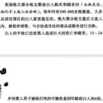

### [tombkeeper](https://weibo.com/101174?refer_flag=1005055015_)  
---
当神棍，长寿或短命皆可。长寿自然是因为道行深，然而死得早必然是因为泄露天机。 

标签： [定期renew](https://www.weibo.com/1401527553/profile?is_tag=1&tag_name=%E5%AE%9A%E6%9C%9Frenew)

---

### [tombkeeper](https://weibo.com/101174?refer_flag=1005055015_)  

[2017-2-9 10:10](https://www.weibo.com/1401527553/EuHQWDHja?from=page_1005051401527553_profile&wvr=6&mod=weibotime) 来自 [微博 weibo.com](http://app.weibo.com/t/feed/6vtZb0)

造谣就抓，没造谣就删。 

标签： [定期renew](https://www.weibo.com/1401527553/profile?is_tag=1&tag_name=%E5%AE%9A%E6%9C%9Frenew)

---

### [tombkeeper](https://weibo.com/101174?refer_flag=1005055015_)  

[2017-2-7 20:01](https://www.weibo.com/1401527553/EusRAEPjj?from=page_1005051401527553_profile&wvr=6&mod=weibotime) 来自 [微博 weibo.com](http://app.weibo.com/t/feed/6vtZb0)

政治正确是现代文明的一部分，比较柔软的那部分。政治正确在文明内部形成了一个缓冲，对文明内部来说是有益的。然而，当遭遇非现代文明时，政治正确的柔软，会令其成为现代文明的死穴，成为现代文明的漏洞。这个死穴被点，这个漏洞被利用，就会伤害甚至毁灭现代文明。 

标签： [定期renew](https://www.weibo.com/1401527553/profile?is_tag=1&tag_name=%E5%AE%9A%E6%9C%9Frenew)

---

### [tombkeeper](https://weibo.com/101174?refer_flag=1005055015_)  

[2017-2-5 09:15](https://www.weibo.com/1401527553/Eu5MHBIRK?from=page_1005051401527553_profile&wvr=6&mod=weibotime)

“巨婴”一听就是在侮辱我，“没长大的孩子”感觉就好多了。 

标签： [定期renew](https://www.weibo.com/1401527553/profile?is_tag=1&tag_name=%E5%AE%9A%E6%9C%9Frenew)

---

### [tombkeeper](https://weibo.com/101174?refer_flag=1005055015_)  

[2017-2-4 10:58](https://www.weibo.com/1401527553/EtX1Z5otq?from=page_1005051401527553_profile&wvr=6&mod=weibotime) 来自 [微博 weibo.com](http://app.weibo.com/t/feed/6vtZb0)

美国的个人信息搜索引擎，用的都是公开合法数据：radaris.com，功能很强。但这实际上也使其成为了一个社工利器。 

标签： [定期renew](https://www.weibo.com/1401527553/profile?is_tag=1&tag_name=%E5%AE%9A%E6%9C%9Frenew) [信息安全](https://www.weibo.com/1401527553/profile?is_tag=1&tag_name=%E4%BF%A1%E6%81%AF%E5%AE%89%E5%85%A8)

---

### [tombkeeper](https://weibo.com/101174?refer_flag=1005055015_)  

[2017-2-1 11:01](https://www.weibo.com/1401527553/EtuLAanVp?from=page_1005051401527553_profile&wvr=6&mod=weibotime) 来自 [微博 weibo.com](http://app.weibo.com/t/feed/6vtZb0)

“兵败如山倒”、“破窗效应”，在人类行为中，“势”是很重要的。一只鼩鼱听说一只普尔加托里猴偷了恐龙蛋，也会想：“哇，我们哺乳动物有机会掌权啊”。所以一些远在天边的事，会比想象的更快更强烈地影响你我，尽管从逻辑上看建立不起因果。因为会让鼩鼱觉得：“哇，我们哺乳动物有机会掌权啊”。 

标签： [定期renew](https://www.weibo.com/1401527553/profile?is_tag=1&tag_name=%E5%AE%9A%E6%9C%9Frenew)

---

### [tombkeeper](https://weibo.com/101174?refer_flag=1005055015_)  

[2017-1-31 22:18](https://www.weibo.com/1401527553/EtpM6oyoP?from=page_1005051401527553_profile&wvr=6&mod=weibotime)

同情，可以让我们体会到自己人性的光辉。但只有合理的规则，以及对规则的严格执行，以及对不遵守规则的严厉谴责，才可能阻止下一个跳进老虎山被咬死的人，以及横穿高速隔离带被撞死的人，以及其它类似情况。 

标签： [定期renew](https://www.weibo.com/1401527553/profile?is_tag=1&tag_name=%E5%AE%9A%E6%9C%9Frenew)

---

### [tombkeeper](https://weibo.com/101174?refer_flag=1005055015_)  

[2017-1-31 11:17](https://www.weibo.com/1401527553/EtlrqCZbS?from=page_1005051401527553_profile&wvr=6&mod=weibotime) 来自 [微博 weibo.com](http://app.weibo.com/t/feed/6vtZb0)

无力氪金，被人民币玩家欺负，不能体面地打网游，没有尊严，好惨。社会不公。 

标签： [定期renew](https://www.weibo.com/1401527553/profile?is_tag=1&tag_name=%E5%AE%9A%E6%9C%9Frenew)

---

### [tombkeeper](https://weibo.com/101174?refer_flag=1005055015_)  

[2017-1-30 10:06](https://www.weibo.com/1401527553/EtbyrCAed?from=page_1005051401527553_profile&wvr=6&mod=weibotime) 来自 [微博 weibo.com](http://app.weibo.com/t/feed/6vtZb0)

这本出版于 2002 年的《愚蠢的白人》堪称白左经典，当年曾名噪一时。书的作者也是著名纪录片《华氏9·11》的导演。阅读时一定要注意，这些言论都是作者的本意，不是在反讽： 

- 
- 
- 
- 
- 
- 
- 
- 
- 

标签： [定期renew](https://www.weibo.com/1401527553/profile?is_tag=1&tag_name=%E5%AE%9A%E6%9C%9Frenew)

---

### [tombkeeper](https://weibo.com/101174?refer_flag=1005055015_)  

[2017-1-29 13:34](https://www.weibo.com/1401527553/Et3ujAcEc?from=page_1005051401527553_profile&wvr=6&mod=weibotime) 来自 [微博 weibo.com](http://app.weibo.com/t/feed/6vtZb0)

从新石器时代到现在，人类智力没有太大变化。这种新石器时代的大脑，竟然能思考并理解宇宙的奥秘。 

标签： [定期renew](https://www.weibo.com/1401527553/profile?is_tag=1&tag_name=%E5%AE%9A%E6%9C%9Frenew)

---

### [tombkeeper](https://weibo.com/101174?refer_flag=1005055015_)  

[2017-1-22 13:14](https://www.weibo.com/1401527553/ErZmuw6x3?from=page_1005051401527553_profile&wvr=6&mod=weibotime) 来自 [微博 weibo.com](http://app.weibo.com/t/feed/6vtZb0)

2013 年，一位数据通信行业的老专家，认为数据通信设备不可能有后门，也不可能被入侵。你跟他认真讨论技术，他就用一种特别浪催的语气绕来绕去。而且一直到 2014 年还在嘴硬。
然而啊，2015 年，某款网络设备被发现存在后门，而这位老专家当年正是该款产品的主要研发人员之一。当然，从时间上看后门不是这位老专家植入的。但是这仍然是一件欢天喜地大快人心的事儿啊。当然，即使如此，你想让他承认自己错了，门儿也没有。
偷换概念，把自己维护的概念无限收窄，是此类人最常用的诡辩武器。比如有人认为手机关机窃听是不可能的。2014 年我在 GeekPwn 上设立了这个挑战，给了一点提示，然后就有同学做出来了。你以为他们会认输吗？当然不可能。他们可以把“关机窃听”的概念收窄到“所有器件完全断电才叫关机”，然后宣布你这个关机窃听不是真正的关机窃听。
再比如有人认为“使用不安全 WiFi 导致网银被窃”是不可能的。假如你找出一个通过 WiFi 植入木马窃取网银的例子，他可以把“使用不安全 WiFi 导致网银被窃”的概念缩窄为“通过 WiFi 嗅探到网银密码”，必须是这种才算。
还有人认为“用了 SSL 就不可能被嗅探”，你找出一个实现漏洞，类似 iOS 那个著名的“Goto Fail”，他会说这个不算，必须是破解了算法才算。其实即使实现了破解算法他也不会认帐的。毕竟诡辩主要靠脸皮，不靠调试器。只要有那个脸皮，很容易从一个胜利走向另一个胜利，实现“微博打假无一失手”。
当然，偷换概念还算是人类行为范畴内的。还有更下贱的。比如你跟他们谈技术，他们狗急跳墙的时候会丢出一句：“那你们公司的产品也会被嗅探吗？请正面回答我”。

标签： [定期renew](https://www.weibo.com/1401527553/profile?is_tag=1&tag_name=%E5%AE%9A%E6%9C%9Frenew) [信息安全](https://www.weibo.com/1401527553/profile?is_tag=1&tag_name=%E4%BF%A1%E6%81%AF%E5%AE%89%E5%85%A8)

---

### [tombkeeper](https://weibo.com/101174?refer_flag=1005055015_)  

[2017-1-21 12:38](https://www.weibo.com/1401527553/ErPHuc2d6?from=page_1005051401527553_profile&wvr=6&mod=weibotime)

国内电视荧幕上有几个人，从内到外地集成了所在地区男性身上各种最具特色的糟糕之处，外加几样中华民族的传统丑德，然而却颇有拥趸，于是自我感觉极其美好，以某种传承者自居。这些人，现在终于少了一个。  

标签： [定期renew](https://www.weibo.com/1401527553/profile?is_tag=1&tag_name=%E5%AE%9A%E6%9C%9Frenew)

---

### [tombkeeper](https://weibo.com/101174?refer_flag=1005055015_)  

[2017-1-21 11:02](https://www.weibo.com/1401527553/ErP4DDIrs?from=page_1005051401527553_profile&wvr=6&mod=weibotime) 来自 [微博 weibo.com](http://app.weibo.com/t/feed/6vtZb0)

认为“好男不跟女斗”，也是性别歧视。对认可男女两性都要讲道理、有责任、有担当，有话说话，有错认错的妇女同志，是可以也应该和她们平等讨论问题的。但部分活泼多情的年轻女同志，滥用自己的性别优势，因为反正瞎扯败露最后只要一撒娇，就能得到 IT 男们的柔情谅解。这种就不适合跟她们讲理。 

标签： [定期renew](https://www.weibo.com/1401527553/profile?is_tag=1&tag_name=%E5%AE%9A%E6%9C%9Frenew)

---

### [tombkeeper](https://weibo.com/101174?refer_flag=1005055015_)  

[2017-1-12 08:30](https://www.weibo.com/1401527553/Eqrech1mC?from=page_1005051401527553_profile&wvr=6&mod=weibotime)

“孩子都一岁了你还在喂奶啊？没必要啊，奶水早就没有营养了”！
“我故意的。这个孩子我早就怀疑是我老公跟小三生的”。
[#中华日常生活怼#](https://huati.weibo.com/k/%E4%B8%AD%E5%8D%8E%E6%97%A5%E5%B8%B8%E7%94%9F%E6%B4%BB%E6%80%BC?from=501) 

#### [中华日常生活怼](http://huati.weibo.com/k/%E4%B8%AD%E5%8D%8E%E6%97%A5%E5%B8%B8%E7%94%9F%E6%B4%BB%E6%80%BC?m=4063011964056822&u=1401527553)

[参与讨论](javascript:void(0)) [*+*关注](javascript:void(0))

标签： [笑话](https://www.weibo.com/1401527553/profile?is_tag=1&tag_name=%E7%AC%91%E8%AF%9D) [定期renew](https://www.weibo.com/1401527553/profile?is_tag=1&tag_name=%E5%AE%9A%E6%9C%9Frenew)

---

### [tombkeeper](https://weibo.com/101174?refer_flag=1005055015_)  

[2017-1-6 20:34](https://www.weibo.com/1401527553/EpBp6a93F?from=page_1005051401527553_profile&wvr=6&mod=weibotime) 来自 [微博 weibo.com](http://app.weibo.com/t/feed/6vtZb0)

最近见识了两个人，一个是“科学，你们懂么”，另一个是“哈耶克，你们懂么”。共同的特点就是口出秽言，肮脏无比，然而内心坦然。 

标签： [定期renew](https://www.weibo.com/1401527553/profile?is_tag=1&tag_name=%E5%AE%9A%E6%9C%9Frenew)

---

### [tombkeeper](https://weibo.com/101174?refer_flag=1005055015_)  

[2017-1-5 09:51](https://www.weibo.com/1401527553/EpnLSmc2D?from=page_1005051401527553_profile&wvr=6&mod=weibotime)

你拆换滤网时看一眼黑灰叹口气是一回事儿，发帖征集滤网收集黑灰做成墨汁写一百个“霾”字搞行为艺术就是另一回事儿。你自己买个空气净化器在家里用用是一回事儿，学校统一装就是另一回事儿。一回事儿是能搞的，另一回事儿是不能搞的。虽然他们那儿早就统一装了。 

标签： [定期renew](https://www.weibo.com/1401527553/profile?is_tag=1&tag_name=%E5%AE%9A%E6%9C%9Frenew)

---

### [tombkeeper](https://weibo.com/101174?refer_flag=1005055015_)  

[2017-1-3 21:53](https://www.weibo.com/1401527553/Ep9DGvuGb?from=page_1005051401527553_profile&wvr=6&mod=weibotime)

我发现只要提到努力进取这样的话题，都有人义正严辞地表达类似“想让我努力进取除非给我很多钱”这样的意思。本科毕业二十二，研究生毕业二十五，随便一晃就三十了。年轻时候对自己不负责，和那些努力的同龄人之间差距越来越大，机会也会越来越少。马太效应是很可怕的。 

标签： [定期renew](https://www.weibo.com/1401527553/profile?is_tag=1&tag_name=%E5%AE%9A%E6%9C%9Frenew)

---

### [tombkeeper](https://weibo.com/101174?refer_flag=1005055015_)  

[2017-1-1 17:08](https://www.weibo.com/1401527553/EoOUZaImO?from=page_1005051401527553_profile&wvr=6&mod=weibotime) 来自 [微博 weibo.com](http://app.weibo.com/t/feed/6vtZb0)

有一种比较高端的洗地方式是把事儿拆细，一点一点分析，最后发现谁都没错。乍一看感觉还特别善良理性：
“玉帝给他一个改过的机会，多么慈悲。”
“他一个猴儿，想忍住不吃蟠桃，怎么可能？”
“几个仙女，又怎么是齐天大圣的对手？” 

标签： [定期renew](https://www.weibo.com/1401527553/profile?is_tag=1&tag_name=%E5%AE%9A%E6%9C%9Frenew)

---

### [tombkeeper](https://weibo.com/101174?refer_flag=1005055015_)  

[2017-1-1 16:29](https://www.weibo.com/1401527553/EoOFhd1kc?from=page_1005051401527553_profile&wvr=6&mod=weibotime) 来自 [微博 weibo.com](http://app.weibo.com/t/feed/6vtZb0)

“怎么学XX”这样的问题，有点类似问路。别人只能给你指个方向。但多数人想要的都是 GPS，给他规划好详细路线，到哪儿该变道，实时路况怎么样。多学一点额外的东西，就感觉自己吃亏了。
“从西直门到天安门怎么走？”
“坐地铁二号线到复兴门再转一号线。”
“我看地图这样是走了一个直角，感觉绕远了。有没有直接去的路？”

标签： [定期renew](https://www.weibo.com/1401527553/profile?is_tag=1&tag_name=%E5%AE%9A%E6%9C%9Frenew)

---

### [tombkeeper](https://weibo.com/101174?refer_flag=1005055015_)  

[2017-1-1 10:56](https://www.weibo.com/1401527553/EoMuko2Cq?from=page_1005051401527553_profile&wvr=6&mod=weibotime) 来自 [微博 weibo.com](http://app.weibo.com/t/feed/6vtZb0)

小明想知道给设备消毒的人是谁。这样，如果因为这个人工作不认真而导致小明被传染了，小明就可以去杀了他。
这一次，小明运气很好，那个人运气也很好。
大家觉得小明的想法很有道理，都开始这么做。于是，有很多人被传染了，有很多人被杀掉了。
小明问观音菩萨：难道认真工作比死还难吗？

标签： [定期renew](https://www.weibo.com/1401527553/profile?is_tag=1&tag_name=%E5%AE%9A%E6%9C%9Frenew)

---

### [tombkeeper](https://weibo.com/101174?refer_flag=1005055015_)  

[2016-12-27 09:27](https://www.weibo.com/1401527553/Eo0Lv1LJA?from=page_1005051401527553_profile&wvr=6&mod=weibotime) 来自 [微博 weibo.com](http://app.weibo.com/t/feed/6vtZb0)

冬吃萝卜夏吃姜，然而姜驱寒。
男吃韭菜女吃藕，然而吃藕丑。 

标签： [笑话](https://www.weibo.com/1401527553/profile?is_tag=1&tag_name=%E7%AC%91%E8%AF%9D) [定期renew](https://www.weibo.com/1401527553/profile?is_tag=1&tag_name=%E5%AE%9A%E6%9C%9Frenew)

---

### [tombkeeper](https://weibo.com/101174?refer_flag=1005055015_)  

[2016-12-23 15:15](https://www.weibo.com/1401527553/EnrkE0gpv?from=page_1005051401527553_profile&wvr=6&mod=weibotime)

小时候跟着我老娘看琼瑶剧，里面各种老贱人小贱人，从第 1 集贱到第 39 集，不断贱出新高度，最后第 40 集幡然悔悟，获得岳翎刘雪华们的原谅，然后大家其乐融融地生活在一起。我每看一集都要念二十遍“今日把示君，谁为不平事”才能缓过来。眼下国内这一代圣母，我感觉琼瑶阿姨可能多少有点责任。 

标签： [定期renew](https://www.weibo.com/1401527553/profile?is_tag=1&tag_name=%E5%AE%9A%E6%9C%9Frenew)

---

### [tombkeeper](https://weibo.com/101174?refer_flag=1005055015_)  

[2016-12-22 20:19](https://www.weibo.com/1401527553/EnjTyiLHX?from=page_1005051401527553_profile&wvr=6&mod=weibotime) 来自 [微博 weibo.com](http://app.weibo.com/t/feed/6vtZb0)

从事任何技术研究，不知道该干什么的时候，就问自己四个问题：
•这个方向上最新进展是什么？ 都知道吗？
•这个方向上最著名的专家有哪些？他们的研究都看过吗？
•这个方向上最著名的技术社区有哪些？精华帖都看过一遍吗？
•这个方向上最重要的文章、工具有哪些？文章都看过吗？工具都分析过吗？ 

标签： [定期renew](https://www.weibo.com/1401527553/profile?is_tag=1&tag_name=%E5%AE%9A%E6%9C%9Frenew)

---

### [tombkeeper](https://weibo.com/101174?refer_flag=1005055015_)  

[2016-12-21 07:33](https://www.weibo.com/1401527553/En5sh1L8z?from=page_1005051401527553_profile&wvr=6&mod=weibotime)

钻山豹和座山雕抢地盘。你说我是正义的来福林，我要为民除害，我要剿匪。结果你专门打钻山豹，不打座山雕，或者隔半个月朝座山雕放个空枪装装样子。这种剿匪，我很难说你是正义的来福林还是座山雕的粉丝啊。 

标签： [定期renew](https://www.weibo.com/1401527553/profile?is_tag=1&tag_name=%E5%AE%9A%E6%9C%9Frenew)

---

### [tombkeeper](https://weibo.com/101174?refer_flag=1005055015_)  

[2016-12-13 20:08](https://www.weibo.com/1401527553/ElWYCFxxp?from=page_1005051401527553_profile&wvr=6&mod=weibotime) 来自 [微博 weibo.com](http://app.weibo.com/t/feed/6vtZb0)

夏达事件只是整个环境的投影。本来骗子就多，契约精神的重要性又被排在一堆乱七八糟的老理儿后面，相当一部分舆论是骚浪贱的（“为啥不骗别人专门骗你”、“做人要知足”、“要懂得感恩”），所以从好人过度到骗子的心理不适感比较低。于是骗子就越来越多，大家越来越习惯骗子的存在，正反馈就形成了。 

标签： [定期renew](https://www.weibo.com/1401527553/profile?is_tag=1&tag_name=%E5%AE%9A%E6%9C%9Frenew)

---

### [tombkeeper](https://weibo.com/101174?refer_flag=1005055015_)  

[2016-12-12 23:47](https://www.weibo.com/1401527553/ElOZfvB6G?from=page_1005051401527553_profile&wvr=6&mod=weibotime)

车辆有了自动驾驶功能后，即使尸体坐在驾驶位上也能行驶。利用这一点，可以伪造死亡时间和死亡地点。 

标签： [定期renew](https://www.weibo.com/1401527553/profile?is_tag=1&tag_name=%E5%AE%9A%E6%9C%9Frenew)

---

### [tombkeeper](https://weibo.com/101174?refer_flag=1005055015_)  

[2016-12-11 20:46](https://www.weibo.com/1401527553/ElEn5fzGH?from=page_1005051401527553_profile&wvr=6&mod=weibotime) 来自 [微博 weibo.com](http://app.weibo.com/t/feed/6vtZb0)

小明用灵魂向撒旦换了很多钱和很多知识。然后给村里修了路，建起了养殖场，引进了农业科技。村里人原本不相信科技，但看到小明这么有钱，也就相信了。大家渐渐富了起来。但还是小明最富，而且娶了村里最漂亮的姑娘。后来，村里人杀了小明。但他们不知道，小明的灵魂属于撒旦。所以，小明现在是魔鬼了。 

标签： [定期renew](https://www.weibo.com/1401527553/profile?is_tag=1&tag_name=%E5%AE%9A%E6%9C%9Frenew)

---

### [tombkeeper](https://weibo.com/101174?refer_flag=1005055015_)  

[2016-12-7 08:44](https://www.weibo.com/1401527553/EkXWi1nfh?from=page_1005051401527553_profile&wvr=6&mod=weibotime)

不少朋友一提语文教育，都要批判国内中小学的“总结段落大意、归纳中心思想”。然而我一直觉得这是极重要的训练。有了这个功夫，你才能在看完几千字催人尿下的知音体后仍能清醒地产生疑问：“写得是挺感人，但关键的东西都没说啊”。才能体会到孔老夫子说的：巧言令色，鲜矣仁。而不是为巧言令色所惑。 

标签： [定期renew](https://www.weibo.com/1401527553/profile?is_tag=1&tag_name=%E5%AE%9A%E6%9C%9Frenew)

---

### [tombkeeper](https://weibo.com/101174?refer_flag=1005055015_)  

[2016-12-1 10:22](https://www.weibo.com/1401527553/Ek40NojuB?from=page_1005051401527553_profile&wvr=6&mod=weibotime) 来自 [微博 weibo.com](http://app.weibo.com/t/feed/6vtZb0)

十几年前，闹保钓的时候，有人搞了个保钓网站。满屏标语口号，下有捐款帐号。那会儿支付没现在这么方便，还都是银行转账，就这最后也搞了两千多万。
当你要做决定的时候，先摸一下自己的脉搏，如果比平时每分钟高了 10 次以上，这时候就不适合做决定。喝杯茶，过会儿再说。 

标签： [定期renew](https://www.weibo.com/1401527553/profile?is_tag=1&tag_name=%E5%AE%9A%E6%9C%9Frenew)

---

### [tombkeeper](https://weibo.com/101174?refer_flag=1005055015_)  

[2016-11-30 14:39](https://www.weibo.com/1401527553/EjWgRBqzp?from=page_1005051401527553_profile&wvr=6&mod=weibotime) 来自 [微博 weibo.com](http://app.weibo.com/t/feed/6vtZb0)

骗，在法律上的惩罚比偷和抢要小。但骗所造成的社会危害可能比偷和抢都要大。骗会消解人和人之间的信任，结果就是增加整个社会的运行成本。 

标签： [定期renew](https://www.weibo.com/1401527553/profile?is_tag=1&tag_name=%E5%AE%9A%E6%9C%9Frenew)

---

### [tombkeeper](https://weibo.com/101174?refer_flag=1005055015_)  

[2016-11-28 07:53](https://www.weibo.com/1401527553/EjALa0rN5?from=page_1005051401527553_profile&wvr=6&mod=weibotime)

看到有人从地上捡了耗子药吃，你会大喊“有毒”，还是“不卫生”？如果齐国人认为秦国人都是大老粗，这是政治不正确。如果齐国人认为秦国人胆小怕事不敢打仗——虽然同样是对一个群体进行评价，这时候，谈政治不正确，就好像在说吃地上的耗子药不卫生。 

标签： [定期renew](https://www.weibo.com/1401527553/profile?is_tag=1&tag_name=%E5%AE%9A%E6%9C%9Frenew)

---

### [tombkeeper](https://weibo.com/101174?refer_flag=1005055015_)  

[2016-11-27 14:15](https://www.weibo.com/1401527553/EjtPIqeWn?from=page_1005051401527553_profile&wvr=6&mod=weibotime)

不想劳动的女性和净想好事的男性是互联网业务的重要基石。 

标签： [定期renew](https://www.weibo.com/1401527553/profile?is_tag=1&tag_name=%E5%AE%9A%E6%9C%9Frenew)

---

### [tombkeeper](https://weibo.com/101174?refer_flag=1005055015_)  

[2016-11-18 20:03](https://www.weibo.com/1401527553/Ei9gb27AG?from=page_1005051401527553_profile&wvr=6&mod=weibotime) 来自 [微博 weibo.com](http://app.weibo.com/t/feed/6vtZb0)

非常巧，一天之中两个创业的哥们分别向我抱怨遇到的各种艰辛和委屈，以及有时候必须牺牲一些尊严。我也只能劝他们：自己一个人可以讲点知识分子的清高，但很多人指着你吃饭的时候，脸就不只是自己的了。这不是不要脸，这是舍己为人。 

标签： [定期renew](https://www.weibo.com/1401527553/profile?is_tag=1&tag_name=%E5%AE%9A%E6%9C%9Frenew)

---

### [tombkeeper](https://weibo.com/101174?refer_flag=1005055015_)  

[2016-11-12 11:07](https://www.weibo.com/1401527553/EhbbV3utb?from=page_1005051401527553_profile&wvr=6&mod=weibotime) 来自 [微博 weibo.com](http://app.weibo.com/t/feed/6vtZb0)

除非存在一个全知全能的无情感强力执行者，否则几乎所有打赌都是不公平的。因为每个人押上的，不止赌约中指定的，还有自己的道德观念。而不同的人，道德观念是不同的。有些人赌输了如果选择耍赖，内心要承受巨大的道德压力。而有些人则完全不认为耍赖有什么大不了。吃土？弄点奥利奥渣就是了。 

标签： [定期renew](https://www.weibo.com/1401527553/profile?is_tag=1&tag_name=%E5%AE%9A%E6%9C%9Frenew)

---

### [tombkeeper](https://weibo.com/101174?refer_flag=1005055015_)  

[2016-11-4 11:38](https://www.weibo.com/1401527553/EfXYmionQ?from=page_1005051401527553_profile&wvr=6&mod=weibotime) 来自 [微博 weibo.com](http://app.weibo.com/t/feed/6vtZb0)

美国大选这场折腾，也许会让更多人去怀疑：有可能，那些人中的大部分，不止这两个，不止这个国家，是那些人中的大部分，都是坏人。或者说，那些人的善恶标准和我们不同。 

标签： [定期renew](https://www.weibo.com/1401527553/profile?is_tag=1&tag_name=%E5%AE%9A%E6%9C%9Frenew)

---

### [tombkeeper](https://weibo.com/101174?refer_flag=1005055015_)  

[2016-10-23 08:23](https://www.weibo.com/1401527553/Ee7zln7s7?from=page_1005051401527553_profile&wvr=6&mod=weibotime)

假设有A、B两个人，A道德水准较低，在中等收入状态偷东西的概率为50%；B的道德水准较高，在低收入状态偷东西的概率为1%。现在只有一个工作机会，如考虑社会利益最大化，这个工作机会应该给谁？ 

标签： [定期renew](https://www.weibo.com/1401527553/profile?is_tag=1&tag_name=%E5%AE%9A%E6%9C%9Frenew)

---

### [tombkeeper](https://weibo.com/101174?refer_flag=1005055015_)  

[2016-10-21 20:05](https://www.weibo.com/1401527553/EdTj4DLxM?from=page_1005051401527553_profile&wvr=6&mod=weibotime) 来自 [微博 weibo.com](http://app.weibo.com/t/feed/6vtZb0)

【为什么蠢人比坏人更可怕？】《庄子》中有个故事：南海之王“倏”，北海之王“忽”，中央之王“浑沌”。浑沌对倏和忽很好。倏和忽想报答浑沌。他们觉得大家都有七窍，但浑沌没有，就为浑沌凿七窍。每天凿一个，七天后，七窍凿出来了，浑沌也死了。这个故事又叫《我是为你好》。[*O*网页链接](http://t.cn/RVCOWiy) 

标签： [定期renew](https://www.weibo.com/1401527553/profile?is_tag=1&tag_name=%E5%AE%9A%E6%9C%9Frenew)

---

### [tombkeeper](https://weibo.com/101174?refer_flag=1005055015_)  

[2016-10-4 10:25](https://www.weibo.com/1401527553/EbffpnCCa?from=page_1005051401527553_profile&wvr=6&mod=weibotime) 来自 [微博 weibo.com](http://app.weibo.com/t/feed/6vtZb0)

[*O*网页链接](http://t.cn/RVvQaX2) 在这篇论文中，Carlo M. Cipolla 将人分为“怂，智，恶，蠢”四类。又提出并详述了蠢人五律：1、大家总是会低估身边蠢人的数量；2、蠢人在各种人群中都是平均分布的；3、蠢人损人不利己；4、蠢人的危害总被低估，而其危害的确定性总被忽视；5、蠢人是最危险的人，比恶人更可怕。 

标签： [定期renew](https://www.weibo.com/1401527553/profile?is_tag=1&tag_name=%E5%AE%9A%E6%9C%9Frenew)

---

### [tombkeeper](https://weibo.com/101174?refer_flag=1005055015_)  

[2016-10-3 10:06](https://www.weibo.com/1401527553/Eb5HaFJXn?from=page_1005051401527553_profile&wvr=6&mod=weibotime) 来自 [微博 weibo.com](http://app.weibo.com/t/feed/6vtZb0)

“反思”有两种：一种是球打输了，反思自己的训练强度是不是不够，训练方法是不是有问题；还有一种是球打输了，反思打这个球到底有没有意义。第一种容易痛苦，第二种容易快乐。 

标签： [定期renew](https://www.weibo.com/1401527553/profile?is_tag=1&tag_name=%E5%AE%9A%E6%9C%9Frenew)

---

### [tombkeeper](https://weibo.com/101174?refer_flag=1005055015_)  

[2016-9-13 13:20](https://www.weibo.com/1401527553/E84q9kIlu?from=page_1005051401527553_profile&wvr=6&mod=weibotime) 来自 [iPhone 6s Plus](http://app.weibo.com/t/feed/5B6hUc)

纪律和规则，本身只是几行文本。严格执行，就是法律；选择性执行，就是政治。王子犯法罚酒三杯，是选择性执行。只管破坏草坪不管随地大小便，也是选择性执行。 

标签： [定期renew](https://www.weibo.com/1401527553/profile?is_tag=1&tag_name=%E5%AE%9A%E6%9C%9Frenew)

---

### [tombkeeper](https://weibo.com/101174?refer_flag=1005055015_)  

[2016-8-17 12:15](https://www.weibo.com/1401527553/E3XskeWha?from=page_1005051401527553_profile&wvr=6&mod=weibotime) 来自 [微博 weibo.com](http://app.weibo.com/t/feed/6vtZb0)

如果一个问题打有狗那年就开始讨论，而且已经比较清晰，忽然又有人翻出来，其实就应该多长个心眼去看。比如说，如果日本一直宣扬相扑是国术，是国之根本，后来渐渐发现自己相扑干不过蒙古了，就转而谈“吃成胖子没啥了不起”，这事儿就很值得玩味。然而不少相扑选手太容易被迷惑，被卖了还帮着助威。 

标签： [定期renew](https://www.weibo.com/1401527553/profile?is_tag=1&tag_name=%E5%AE%9A%E6%9C%9Frenew)

---

### [tombkeeper](https://weibo.com/101174?refer_flag=1005055015_)  

[2016-8-14 08:21](https://www.weibo.com/1401527553/E3tDAA5fI?from=page_1005051401527553_profile&wvr=6&mod=weibotime) 来自 [微博 weibo.com](http://app.weibo.com/t/feed/6vtZb0)

如不追求复仇之甜蜜，则遭受的背叛之痛苦毫无意义。 

标签： [定期renew](https://www.weibo.com/1401527553/profile?is_tag=1&tag_name=%E5%AE%9A%E6%9C%9Frenew)

---

### [tombkeeper](https://weibo.com/101174?refer_flag=1005055015_)  

[2016-8-11 10:43](https://www.weibo.com/1401527553/E32hRoxYX?from=page_1005051401527553_profile&wvr=6&mod=weibotime) 来自 [iPhone 6s Plus](http://app.weibo.com/t/feed/5B6hUc)

很多技术社区里，一半以上的提问都没有详细准确地描述问题。这些问题就像一个个MD5，解答者需要自己去猜真正的问题是什么，然后再去回答。还有一种很常见的情况是在得到解答之后，提问者忽然发现这个问题问得很傻，于是否认说自己问的其实不是这个问题——反正问题描述的非常模糊，很容易做多种解释。 

标签： [定期renew](https://www.weibo.com/1401527553/profile?is_tag=1&tag_name=%E5%AE%9A%E6%9C%9Frenew)

---

### [tombkeeper](https://weibo.com/101174?refer_flag=1005055015_)  

[2016-8-7 05:46](https://www.weibo.com/1401527553/E2oDwvYVW?from=page_1005051401527553_profile&wvr=6&mod=weibotime) 来自 [iPhone 6s Plus](http://app.weibo.com/t/feed/5B6hUc)

变心的哪个当初没海誓山盟？赖账的谁不说“下个月一定还”？承诺只是一种仪式，真正靠得住的是不动产抵押和三尸脑神丹。 

标签： [定期renew](https://www.weibo.com/1401527553/profile?is_tag=1&tag_name=%E5%AE%9A%E6%9C%9Frenew)

---

### [tombkeeper](https://weibo.com/101174?refer_flag=1005055015_)  

[2016-8-5 02:03](https://www.weibo.com/1401527553/E24jFzQD3?from=page_1005051401527553_profile&wvr=6&mod=weibotime) 来自 [iPhone 6s Plus](http://app.weibo.com/t/feed/5B6hUc)

最基本的厚道，是不要自己吃饱了就想着砸锅，自己上岸了就想着凿船，巴不得别人都泡在水里饿着。 

标签： [定期renew](https://www.weibo.com/1401527553/profile?is_tag=1&tag_name=%E5%AE%9A%E6%9C%9Frenew)

---

* 