# 群晖DSM6.1应用详解 篇三

> 此文章原载于https://post.smzdm.com/p/552010/作者[逸行风](https://zhiyou.smzdm.com/member/1480433216/) 
>
> 非常感谢[逸行风](https://zhiyou.smzdm.com/member/1480433216/) ，orz。转载用来备份和查询，如有侵权，还望告知。
>
> 转载人：fzuxiaoxiaoc#gmail.com

书接上回，群晖NAS的数据安全三猛将——同步-Cloud Station、备份-Hyper Backup、快照-Snapshot Replication以及新兵USB Copy2.0的详解很受大家欢迎，在此感谢值友抬爱，这次要说到的Photo Station、Video Station、Audio Station还有Download Station是群晖DSM的老班底，长期霸占套件首页的推荐前4名，这次就来给大家叨逼叨下这4位老扛把子 。

​      带目录，可使用Ctrl+F查找关键字

​       1、Photo Station

​       2、Video Station

​       3、Audio Station

​       4、Download Station

##  →1、Photo Station 

​        Photo Station原本的功能已经满足我保存家庭照片的需求，这次DSM6.1的升级带来了在2017年的群晖大会上做过介绍的新功能——为通过共享链接共享的照片添加修改和删除的选项，这个功能乍一看对个人用户没有什么用处，却体现了群晖对Photo Station的定位→不仅仅满足于个人用户分享和保存家庭照片的需要，还将为摄影工作室提供更为专业的服务选项 。

[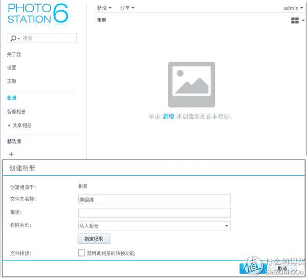](https://post.smzdm.com/p/552010/pic_2/)

首次进入Photo Station的相册空空如也，直接把头一阵子泰国游的照片导进来试试 ~如果有其他的照片[文件夹](https://www.smzdm.com/fenlei/wenjianjia/)，最好一并添加进来。

[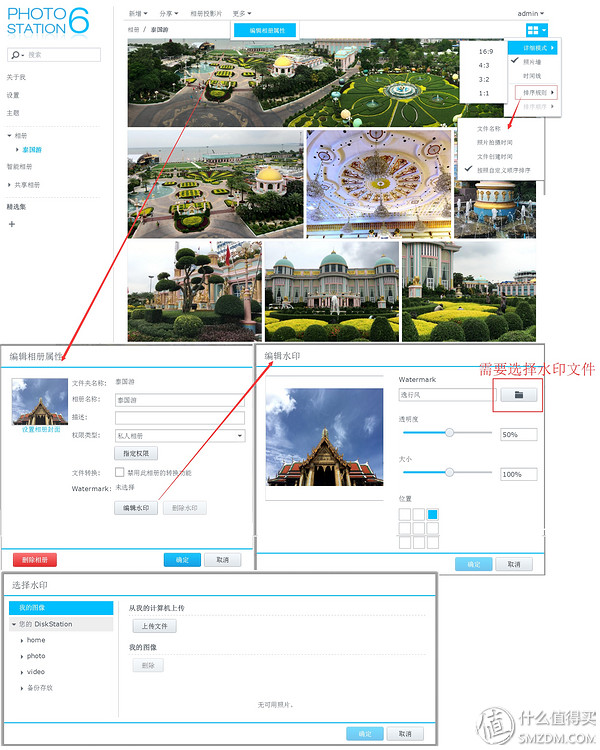](https://post.smzdm.com/p/552010/pic_3/)

​       Photo Station在DSM6.1的界面小进化了一下，全景图默认可以显示 ，不再像6.0时候全部默认为4:3形式显示，在右上角的选项中设置16:9、4:3、3:2等长宽比的显示比例，时间线选项也在这里，还可以按照创建时间，拍摄时间等条件排列显示

​       这次添加了照片水印功能，不过需要制作好水印图片，并导入，水印位置目前是按照正方形九格分布，并不能随意挪动，不过可以调整透明度和大小

[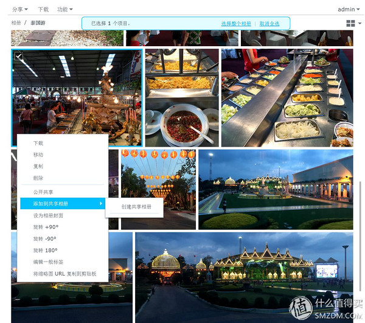](https://post.smzdm.com/p/552010/pic_4/)

​       右键菜单可对照片进行具体设置，比如下载、移动、复制，还可以添加标签，进行共享，比DSM6.0增加了旋转照片角度的选项，方便调整原图

[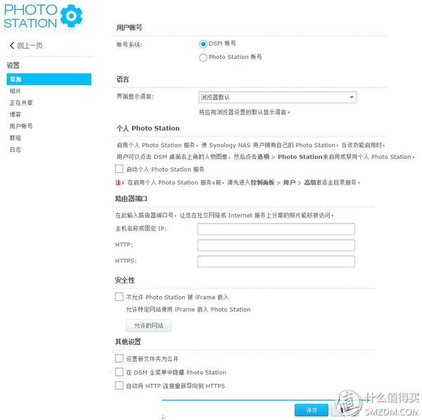](https://post.smzdm.com/p/552010/pic_5/)

​       常规设置界面没有啥变化，还是和DSM6.0一样的选项，分为常规、相片、正在共享、博客、用户账号、群组、日志等七项，主要的部分设置都相对繁杂 。不过需要注意的是如果多人共用一台群晖NAS，那么开启个人Photo Station服务是非常必要的！这样每个账号都会有个人文件夹，设定好权限就可以做到互不干涉。

​        居然**提示错误和不足和DSM6.0也是一样的 →想要启动“个人Photo Station”服务的，第一、需要进入的是控制面板＞用户账号＞启用家目录服务，而不是提示上所注的内容；第二、要启动“个人Photo Station”服务的还需要启动在选项里（可由主界面右上角的人物头像图标点击个人设置选项进入）的Photo Station下面的相应选项，如下图**

[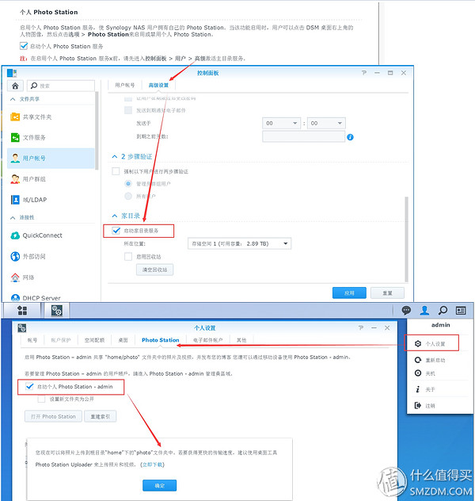](https://post.smzdm.com/p/552010/pic_6/)

按步骤选好即可，然后就安心用吧~ 

[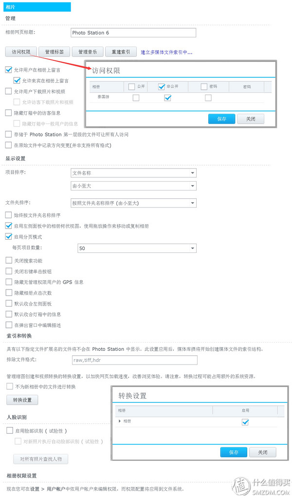](https://post.smzdm.com/p/552010/pic_7/)

​       相片选项主要是针对相册和照片的设置，相册网页标题指的是打开的网页名称，在下面也有选项可以对新相册中的文件转换进行设置（转换速度和群晖NAS机能正相关），脸部识别可以玩玩 

​      Photo Station可以将照片放到新浪微博、QQ空间等网络平台进行分享，至于其他的平台，请使用科学手段上网 ，日志功能可以看到上传的照片情况还有接入查看相册的情况

​      有的人刚入手群晖NAS，还想很快生成缩略图共享（当然可以不进行缩略图展示，不过远程的话会需要更长时间上传完整图片，在运营商那里开启了上传带宽的就没事），其实有一个电脑端的软件可以批量导入照片到Photo Station，再倒入的同时就能够生成缩略图，那就是PhotoStationUploader。

[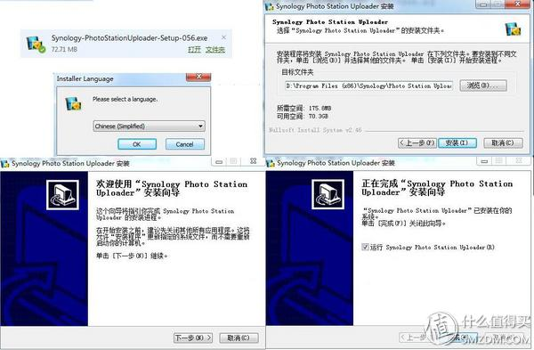](https://post.smzdm.com/p/552010/pic_9/)

[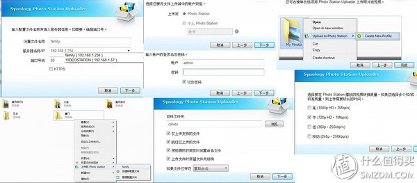](https://post.smzdm.com/p/552010/pic_10/)

​     设定好备份的NAS选项即可，安装完毕之后系统会添加右键选项，可以直接对照片文件夹进行上传。

[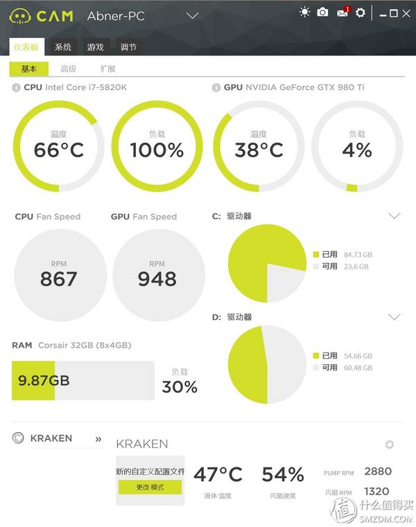](https://post.smzdm.com/p/552010/pic_11/)

[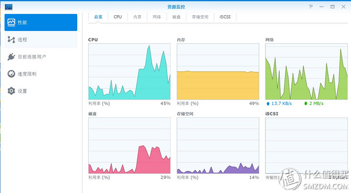](https://post.smzdm.com/p/552010/pic_12/)

[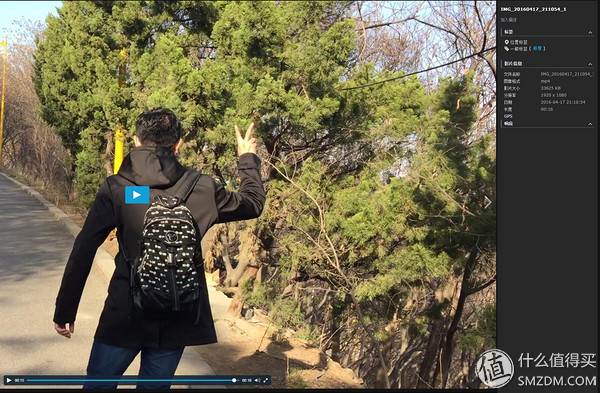](https://post.smzdm.com/p/552010/pic_13/)

​       由[手机](https://www.smzdm.com/fenlei/shouji/)拍摄的MOV视频上传会转码为mp4——上面是我的背影，地点为大连的劳动公园 

​       电脑端上传的好处是解放NAS设备的有限机能，不利用自身CPU来进行转码，交由电脑来进行处理，想快速分享可以采取这种方式，或者入个高端机能强悍的型号。接下来我就要吐个槽了，一旦含有视频且数量较多，因为需要转码处理的原因（如上图的已经打开播放界面的视频，已由原有的mov文件转码为mp4文件），CPU满载[5820k（OC.4Ghz）]，好像在跑测试一样，CPU占用率100%,但是内存占用率和显卡的使用率都不高。这么说吧，要是新用户，直接利用此项功能上传超过4G的相片和视频混合文件夹，那么视视频总量情况而定，你可以去玩会儿手机，我在传的时候就是去看了一会手机；不过单独是照片的话，CPU占用并不高，而且速度快了不少，但是提升有限，因为我倒腾了6000多张图片 

​       接下来是DSM6.1的新功能→为共享链接共享的照片添加修改和删除的选项 

选择好要共享的照片，然后创建共享相册

[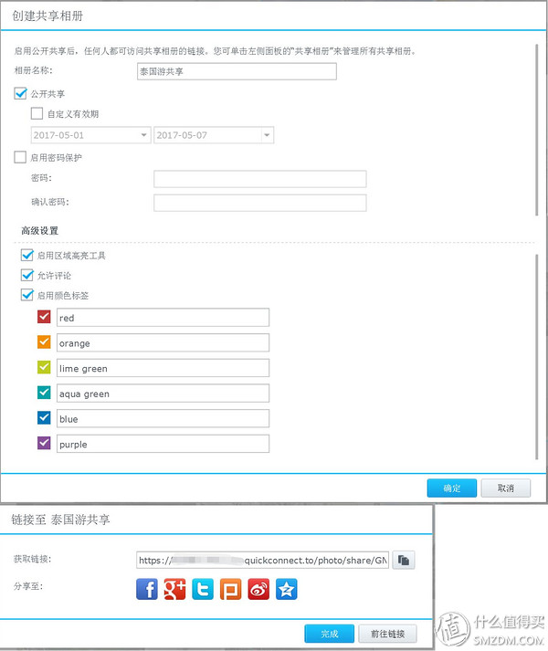](https://post.smzdm.com/p/552010/pic_15/)

​       在创建共享文件夹的时候需要注意的是高级设置，下面的启用区域高亮工具、允许评论、启用颜色标签都是新添加的功能

[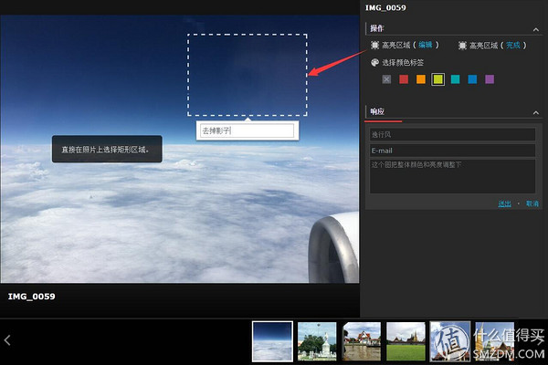](https://post.smzdm.com/p/552010/pic_16/)

​       需要注意的是，高亮区域如果点了编辑就可以添加高亮选择框，并且留言（不过群晖的错别字传统光荣的传承下来，响应是什么鬼！估计是反馈或者留言的意思），可以填写对照片的具体修改方式和想法，这一点非常方便摄影工作室及时收到客户的反馈。

[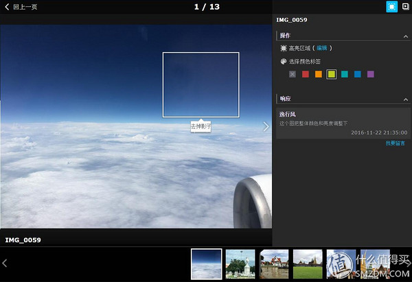](https://post.smzdm.com/p/552010/pic_17/)

​      这次DSM6.1的Photo Station改进主要在可以在每张共享的照片上留言、添加颜色标签还可以标示想要修改的部分，个人可以标示出搞笑的地点并且开通朋友留言，分享乐趣；而影楼用户则可以使客户不必预定时间特意上门，在家打开专有链接就可以看专门为其共享的相册，挑片和改片方便了很多，前提是必须开启大流量的网络上传带宽。

​       分享的步骤很简单：选择照片→生成共享相册→复制专有网络链接→发给朋友

[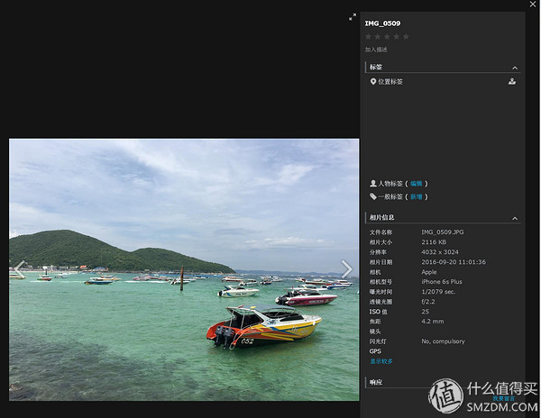](https://post.smzdm.com/p/552010/pic_18/)

​       单张浏览的效果，可以查看拍摄日期，拍摄设备等等

​       **需要注意的是：**共享相册的分享链接，可以针对照片留言、添加颜色标签，还可以标示想要修改的部分，但是以Admin身份登录后，在主界面的相册和共享相册打开已经留言和标示了修改部分的照片，是没有任何显示的，不过不要着急，照片不是丢失了，而是只能通过共享链接打开共享相册才能查看。估计群晖的设计思维是从摄影工作室出发，为客户专门建立的共享相册的修改和留言都是一把一利索 ，照片改好后好带着原片都提供给客户。

​       **DSM6.1对共享照片的留言、添加标签和标示区域等新功能的添加，大大方便了影楼和专业向的个人服务**；而个人方面，现在可以先建立分享相册，然后在旅行过程中不断扩选相片，只要链接有效，所有亲人和朋友都可以看到不断更新的相册并且留言。我觉得如果说DSM6.0中推出的协同表格和Note说明群晖开始向着企业化、专业化迈出了第一步，那么DSM6.1的Photo Station彰显了群晖将企业化、专业化发展的第二步迈进摄影圈的野望。

## →2、Video Station 

​       DSM6.1的Video Station主要更新内容在2017年的群晖大会上做过介绍，添加了家长监护和隐私控制功能 ，确保孩子不到不该看的，对常用Video Station看大姐姐的家长（应该不会有吧）来说是个好功能   

[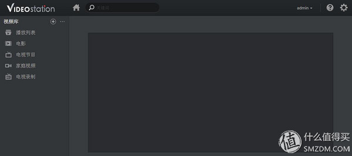](https://post.smzdm.com/p/552010/pic_19/)

​    首次进入主界面是空空荡荡的

[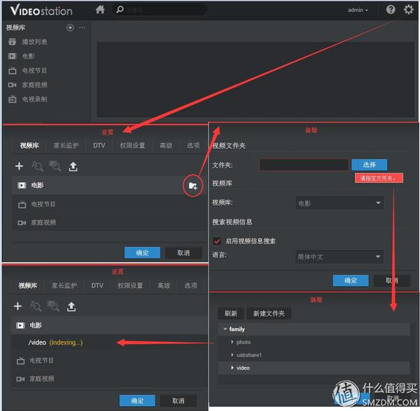](https://post.smzdm.com/p/552010/pic_20/)

需要·先对存放视频的文件夹进行设定，之后Video Station会开始扫描文件夹内的视频

​       扫描速度与机能挂钩，电影海报下载的不错，看着电影海报墙很爽 ，但是有的视频名字不规范或是其他原因，认不出来 

[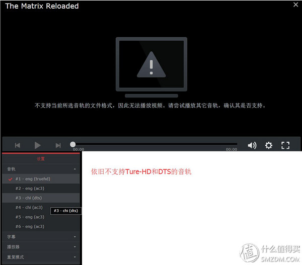](https://post.smzdm.com/p/552010/pic_22/)

依旧不支持Ture-HD和DTS音轨的播放，很多转码高清片不能看了

​    这次DSM6.1带给Video Station的主要更新如上图，家长监护、视频预分析、观看状态提示，这3个改动一是在Video Station上的视频可以针对孩子实行密码保护，二是增强观看体验，三是显示未观看视频和记录播放进度

[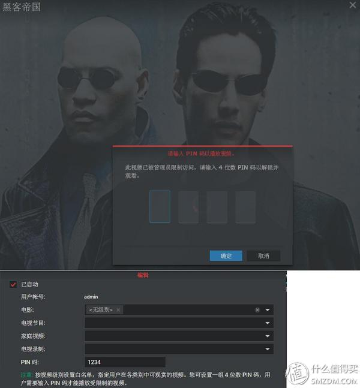](https://post.smzdm.com/p/552010/pic_24/)

如果没有分级信息的视频则可以通过选择无级，然后设定PIN码的方式进行保护，这样无级别的视频也实现了密码保护

[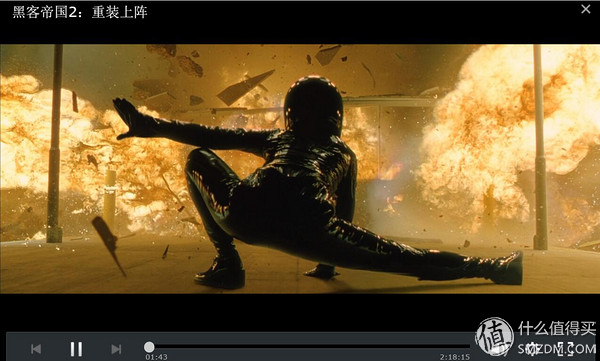](https://post.smzdm.com/p/552010/pic_25/)

​       Video Station的增强观看体验其实就是高级选项中的“对新添加的视频启用预分析以增强观看体验”，说的高大上，要让我说，那就是能够让低端机勉强看转码1080P的视频了，不快进就不会卡，在216j上也可以通过Video Station解码部分高清1080文件，例如上下图的13G左右的黑客帝国2和3，在216j上也可以进行解码，虽然快进的时候会卡上一下，但是正常播放没有啥问题

[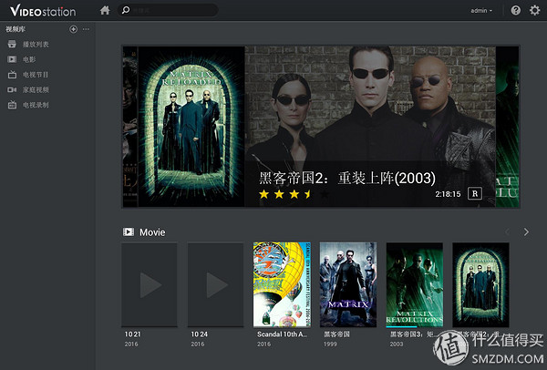](https://post.smzdm.com/p/552010/pic_27/)

​        经过多次改版，Video Station的界面努力向着更美观和便捷进化，要是能够加入[遥控器](https://www.smzdm.com/fenlei/yaokongqi/)和手机控制就更好了 

​       由于Video Station本身并不支持DTS解码，（其实网上也有对应的破解方式，添加第三方文件即可，），对3D原盘什么的也不支持，所以对于高清爱好者来说，这个套件略鸡肋，不如直接入个好点的[电视盒子](https://www.smzdm.com/fenlei/gaoqingbofangqi/)，比如威动、亿格瑞什么的，我就是这么用的，本人测评如下。不过对很多用户，这个套件最应该加入的功能没准是自动加载番号对应的封面吧

[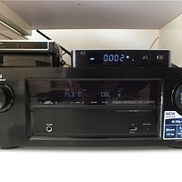](https://post.smzdm.com/p/543311)[客厅来了新盒子 篇一：亿格瑞A5·4K高清+真蓝光导航.顺路怼了开博尔Q6plus](https://post.smzdm.com/p/543311)首先要感谢值友aaarice，为了造福广大值友，先行跳坑入了开博尔Q6Plus，开博尔Q6plus部分主要由值友进行总结，现在他已经退货Q6Plus（不仅因为不支持3D原盘的蓝光导航菜单，还因为很多H264编码的2160P视频播放卡顿以及……不剧透了，请看Q6plus部分），被我带入亿格瑞的坑……由[逸行风](http://zhiyou.smzdm.com/member/1480433216/)|*赞*26*评论*110*收藏*197[查看详情](https://post.smzdm.com/p/543311)

## →3、Audio Station 

​       Audio Station 可以打造个人音乐中心，可以在群晖NAS上选择音乐串流到其他设备上，比如智能电视，网络盒子等等，软件主界面在DSM6.1里进行了很大的调整 

Audio Station的界面变得更加美观

[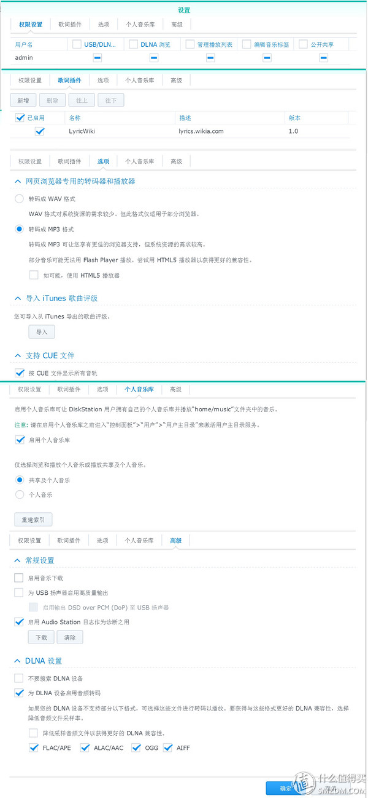](https://post.smzdm.com/p/552010/pic_30/)

​       选项看起来很庞杂，其实非常明晰，喜欢音乐的认真看清，按需设置即可，不过需要注意的是网页浏览器转码默认是MP3 ，WAV格式需要更改选项 。

[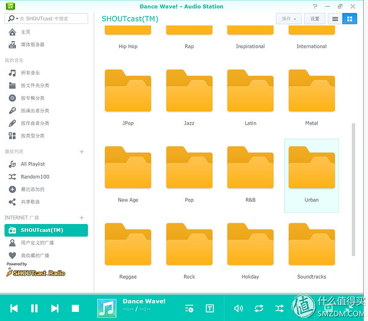](https://post.smzdm.com/p/552010/pic_31/)

[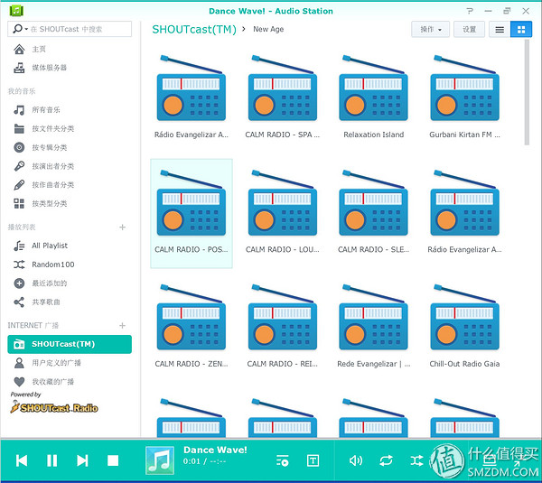](https://post.smzdm.com/p/552010/pic_32/)

同时支持网络电台播放，不过有的网络连接效果并不是太好 

[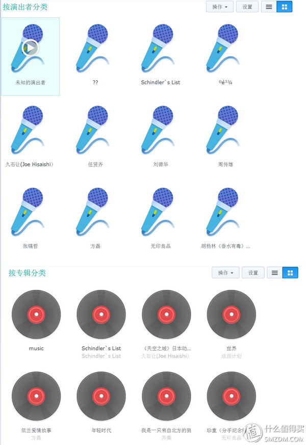](https://post.smzdm.com/p/552010/pic_33/)

[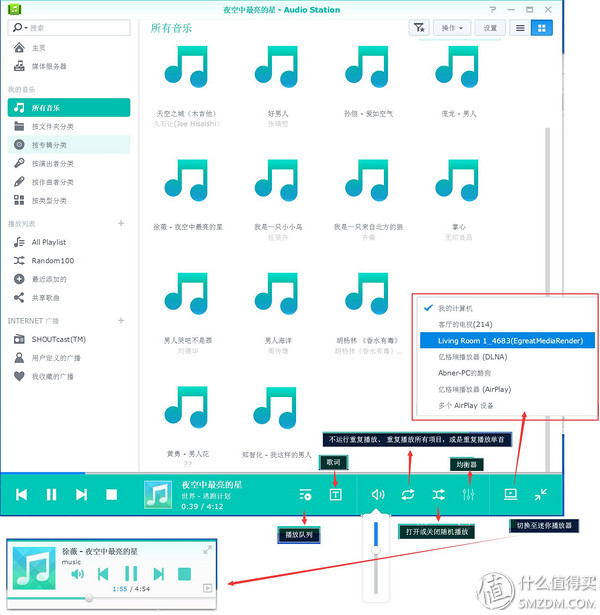](https://post.smzdm.com/p/552010/pic_34/)

​      音乐选项界面进行了美化，不过感觉仍然不够好看 ，而且还有歌的名字认成乱码了 不过功能上还不错，Audio Station 支持许多串流装置，包含计算机、USB 喇叭、媒体播放器、AirPlay、Chromecast Audio 或蓝牙装置等，可以选择在支持的各种局域网内设备进行无缝串流形式的音乐播放 

[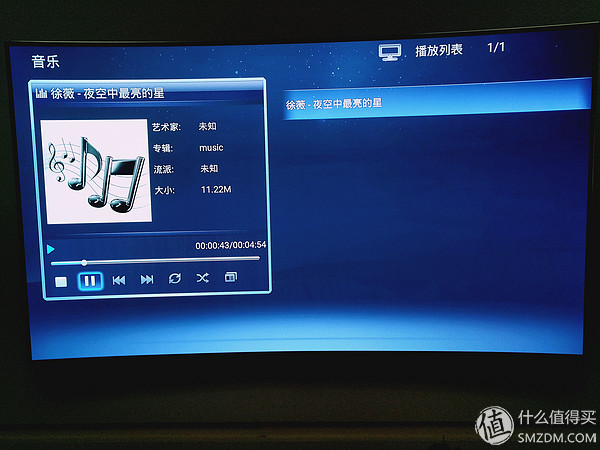](https://post.smzdm.com/p/552010/pic_35/)

​        可以直接通过网络在客厅的[电视盒](https://www.smzdm.com/fenlei/gaoqingbofangqi/)子上输出音频，用客厅的音响听效果还不错的说 

​        苹果设备的iTunes播放当然少不了，在群晖NAS iTunes server设置好名称，并在iTune上添加就好了，截图我忘了放哪了 ，好在步骤不难

​        简单易用，四个字，恩恩

## →4、Download Station

​       群晖NAS的老牌应用，在DSM6.1下是什么样呢？我来看看哈 

[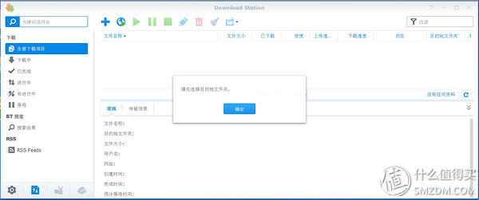](https://post.smzdm.com/p/552010/pic_36/)

​    首次进入套件会提示你设定下载文件存放的文件夹

[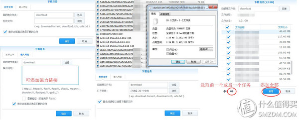](https://post.smzdm.com/p/552010/pic_37/)

​       设定好下载文件夹之后，就可以进入套件的网页端，可以很方便的添加种子或者磁力链接，添加种子能批量一次性添加，我一次添加20个没问题，就是调整下载明细的时候，如果带有额外的广告文件，需要一个一个的进行调整麻烦点，如果能够加入过滤文件的选项就好了

​      如上图，如果批量添加的种子中出现了重复的，Download Station会出现红字提示，并不下载，值得一提的是，在216j同时开启10个下载任务和同时开启20个下载任务的时候，CPU的使用率维持在40%-50%，内存使用率维持在50%-60%之间，并没有太大的机能差距，添加任务数量并没有使得CPU使用率和内存使用率有很大提高，群晖在下载这个方面优化的还是很不错的 

​       至于下载速度，和种子质量还有网速等各种关系密切相关，Download Station正常情况下可以满速，不过一旦种子质量……迅雷现在也各种不给力，下东西确实是个问题 

[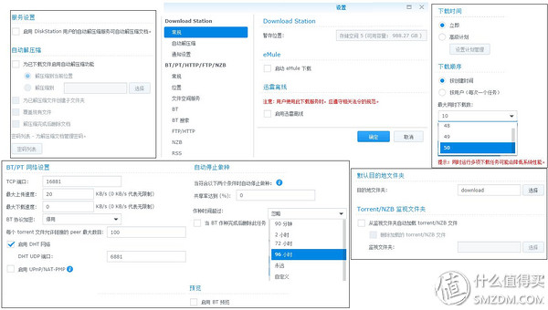](https://post.smzdm.com/p/552010/pic_39/)

​       其实下载的设置界面在我看来除了设置同时下载数量都没啥大不了的，真正的重点是接下来的设置计划管理

[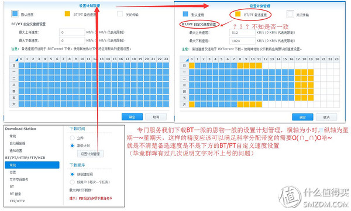](https://post.smzdm.com/p/552010/pic_40/)

​      **设置计划管理——**这个设置选项的出场绝对是我们这些经常进行BT下载的人的恩物 。横轴为小时，纵轴为星期，默认速度，关闭传输，再配合自定义速度设置，基本可以达到娱乐下载两不误，单位时间带宽利用最大化 。

​       请看上图右侧的已经设定好的我的下载计划， 我和老婆正常工作日是每天晚上8点以后开始上网看电视什么的，但是之前会用手机上网看看，所以17点到19点这部分，可以适当下载，20点到24点下载关闭，周末会睡懒觉，但是白天老婆偶尔会看，所以剩下的时间都是限速或者关闭的。当然，也有意外发生，比如说有一次女王因为有事没去上班，偏偏想要看网络电视节目，NAS那可是在全速下载中，当然很卡，于是我接到了电话，女王凄婉的说，老公，家里的网好卡，我想看电视都不行 。机智如我 ，马上拿起手机打开DS get（Download Station的APP），关闭全部的任务。然后？然后当然是女王开开心心的开始看电视了，我家的搓衣板逃过了一劫啊 

​       其实整体上看，DSM6.1相较DSM6.0并没有什么界面上的变化，这次版本的升级光顾着秀于内了 

## 结语

​       Photo Station、Video Station、Audio Station还有Download Station这4位老炮是群晖DSM的老班底，也是长期霸占套件首页的4位金牌打手，DSM6.1的更新带给他们的是细微之处的变化，修修补补，并没有什么根本性的调整。当然，你要说Audio Station界面变好看了，Photo Station支持全景图正常显示了变化挺大，那也算是吧 

​       我个人认为这次DSM6.1更新，最出彩的当属Photo Station，可以为通过共享链接共享的照片添加修改和删除的选项，这项改动虽然看似对个人用户没有什么意义，但是对规模不大，但是突出个性的摄影工作室来说，掌握并熟练使用之后，群晖NAS不仅可以存储照片备份，还提供了很好的增值服务，不仅可以省去专门软件的费用，还能够为客户提供远程网络选片服务 。所以Photo Station在DSM6.1的改动彰显了群晖将企业化、专业化发展的第二步迈进摄影圈的野望，而群晖套件的不断升级，也体现了群晖NAS的保值所在 。

​       有人问APP部分都哪去了，放心，这个系列很长，会开设专贴专讲APP的！ 