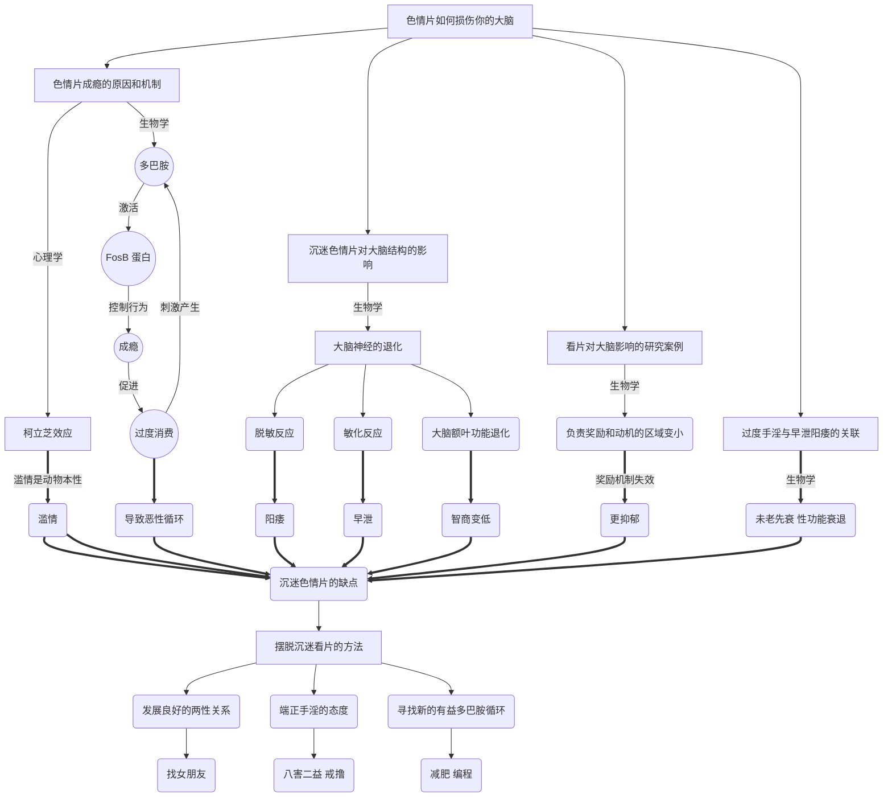

```mermaid
graph TD
a[色情片如何损伤你的大脑]-->b[色情片成瘾的原因和机制]
a[色情片如何损伤你的大脑]-->c[沉迷色情片对大脑结构的影响]
a[色情片如何损伤你的大脑]-->d[看片对大脑影响的研究案例]
a[色情片如何损伤你的大脑]-->e[过度手淫与早泄阳痿的关联]


b[色情片成瘾的原因和机制] -->|心理学| h[柯立芝效应]
b[色情片成瘾的原因和机制] -->|生物学| I[多巴胺分泌] 

c[沉迷色情片对大脑结构的影响]-->|生物学|J[大脑神经的退化]


J[大脑神经的退化]-->L(脱敏反应)
J[大脑神经的退化]-->M(敏化反应)
J[大脑神经的退化]-->N(大脑额叶功能退化)
I[多巴胺分泌] -->|激活|K[FosB 蛋白] 


p((过度消费))-->|刺激产生| I((多巴胺))
K((FosB 蛋白))-->|控制行为| Q((成瘾))
Q((成瘾))-->|促进|p((过度消费))

d[看片对大脑影响的研究案例]-->|生物学|r(负责奖励和动机的区域变小)
r(负责奖励和动机的区域变小)==>|奖励机制失效|s(更抑郁)

h[柯立芝效应]==>|滥情是动物本性|t(滥情)
p((过度消费))==>U(导致恶性循环)
L(脱敏反应)==>V(阳痿)
M(敏化反应)==>S1(早泄)
N(大脑额叶功能退化)==>S2(智商变低)

e[过度手淫与早泄阳痿的关联]==>|生物学|E1(未老先衰 性功能衰退)

t(滥情)==>AA(沉迷色情片的缺点)
U(导致恶性循环)==>AA(沉迷色情片的缺点)
V(阳痿)==>AA(沉迷色情片的缺点)
S1(早泄)==>AA(沉迷色情片的缺点)
S2(智商变低)==>AA(沉迷色情片的缺点)
E1(未老先衰 性功能衰退)==>AA(沉迷色情片的缺点)
s(更抑郁)==>AA(沉迷色情片的缺点)
t(滥情)==>AA(沉迷色情片的缺点)

AA(沉迷色情片的缺点)-->f[摆脱沉迷看片的方法]

f[摆脱沉迷看片的方法]--> F1(发展良好的两性关系)
f[摆脱沉迷看片的方法]--> F2(端正手淫的态度) 
f[摆脱沉迷看片的方法]--> F3(寻找新的有益多巴胺循环) 
F1(发展良好的两性关系)-->F11(找女朋友)
F2(端正手淫的态度)-->F22(八害二益 戒撸)
F3(寻找新的有益多巴胺循环) --> F33(减肥 编程)

```

