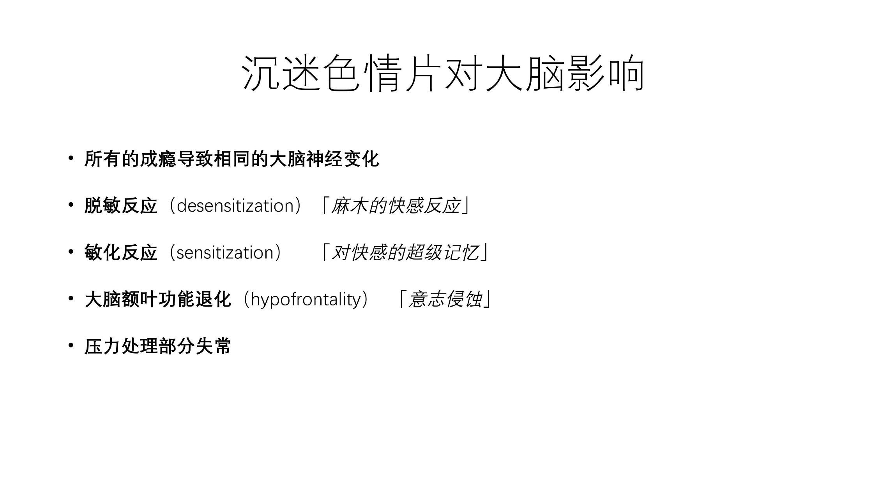
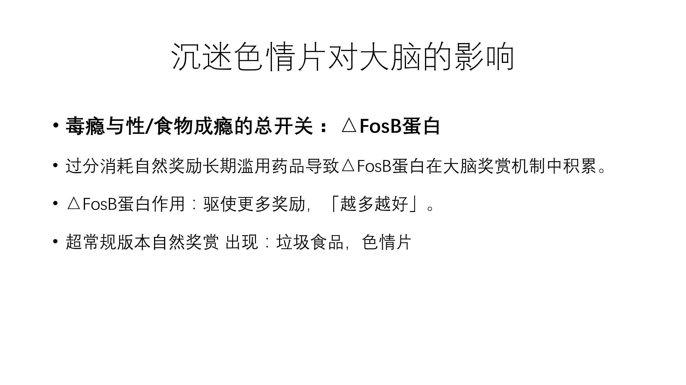

 # 沉迷色情片对大脑的影响

 

* **大脑神经变化**

  

  据研究，所有的成瘾都导致大致相同的一个大脑神经的改变，其中包括几个反应：

  

  * **脱敏反应**

    麻木的快感反应，就是说当你反复的去看一个片子，多巴胺受体的水平他会下降，他不会让你反复的对同一件事一直敏感下去，这也就是说为什么给运动员看片子，敏感反应越来越迟钝了。曾经的爱好兴趣强度不够，需要升级。

    经常去看一些色情图片或者色情的电影，会导致大脑中多巴胺反复不断的去进行刺激，就会变得麻木冷淡。**同样的，两个人恋爱会慢慢的失去激情，慢慢降温了，没有以前感觉那么好了，并不代表你不爱她了，只是脱敏了。**

    2011年的美国医学会杂志精神病学，有一篇论文讲到：刺激越来越多，反应变得越来越迟钝，德国的科学家指出这就意味着大脑更需要更多的多巴胺，才能感受到同等程度的高潮，这就是导致这个用户去搜索色情图片和更重口味的视频才能获得同等程度的性高潮。

    2013年的心理学杂志也有一篇论文讲到：浏览更多的色情图片和色情电影后最终导致的后果是很严重的：**普通的新伴侣和真实的性爱，根本无法唤起性欲，也就是会导致潜在的阳痿。**

    在大量的色情图片或者影片影响下，我们下一代的年轻人，有可能会对经典夫妻间的性爱感到绝望和无趣。

    

  * **敏化反应**

    神经传导通路对于激活奖励机制的承载物更加敏感，比如说经常看片的人，对于怎么去找到一个片，都会比正常人要更快一些，这样就形成一个短路机制。

    

  * **大脑额叶功能退化**

    大脑额叶功能退化，就成瘾者冲动控制能力和预知后果的能力来讲，就是越来越控制不住自己。

    想手淫，反复戒掉忍不住又重新开始，在一个反复的过程，最后导致自己的心理压力越来越大，这样就是同时也会导致恶性循环。

     

* **FosB 蛋白**

  毒瘾，性瘾，食物成瘾，它有一个总开关：FosB蛋白，那就启动和成瘾相关。毒品	之所以虽然奖励机制放大或者抑制了，FosB蛋白的作用，让我们可以得到更多的奖励，而且是越多越好。也正是这样的机制，让人类的极端环境中生存了下来，但是随着互联网这种色情内容的越来越多，这个超常规版本的自然奖赏，具有放大性，让你得到性交和食物越来越多，这就很不好了。

  放松机制是在人类进化过程中产生的重要作用，比如说，我们平时只能吃一个馒头，放松机制，允许你在超出正常心率的情况下能够吃更多，比如说你能够作为一个食物的储备，然后让它存活下来。如果没有这些互联网的影响，到了原始社会或者更往前，可以参考一些动物，它们只有到了交配的季节，才能有配偶与他交配的。

  但是现在情况变得有些不一样，而且**你在网上越来越多的色情片的出现，就相当于给你提供了越来越多的无数的交配机会，这样你的大脑在观看视频的时候，就会被这些交配对象所吸引，以为这二维的图像是真的，而且已经做好了传播基因的准备，甚至要比成吉思汗传播的还要远，这样你就拿上你的鼠标点击一个接一个的图片或者爱情的电影，然后就开始手淫，然后接着再点击，再点击再手淫，应该有一个反复的过程，只要每天也对色情的过度消费，日积月累，放松机制导致你大脑一系列的变化，这就是成瘾的发生。**

   

