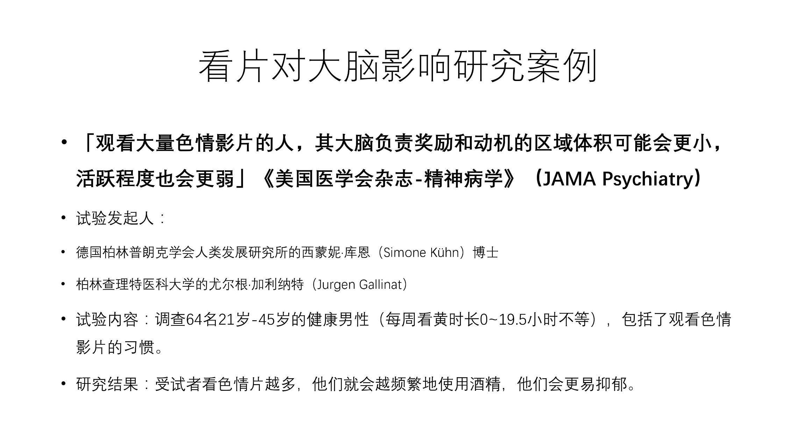

#  5.关于看片对大脑影响的研究案例

根据德国的一项研究了大量观看色情片的人，大脑负责奖励和动机的这个体积会变小，而且活跃程度会更弱。

而研究论文发表在美国医学会杂志精神病学期刊上，德国柏林人类发展研究所的科学家也进行了他们进行的这项研究，他们对这个64年21岁到45岁的男性进行了调查。

调查内容包括了他们看片的习惯：**越克制不住的看片，就会越频繁的去使用酒精，而且他们同样会感觉到更加的抑郁。**

